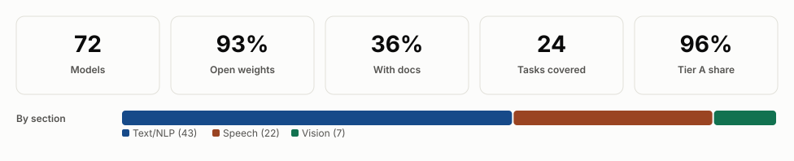
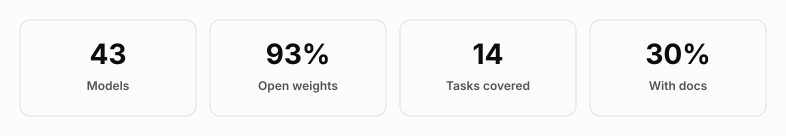
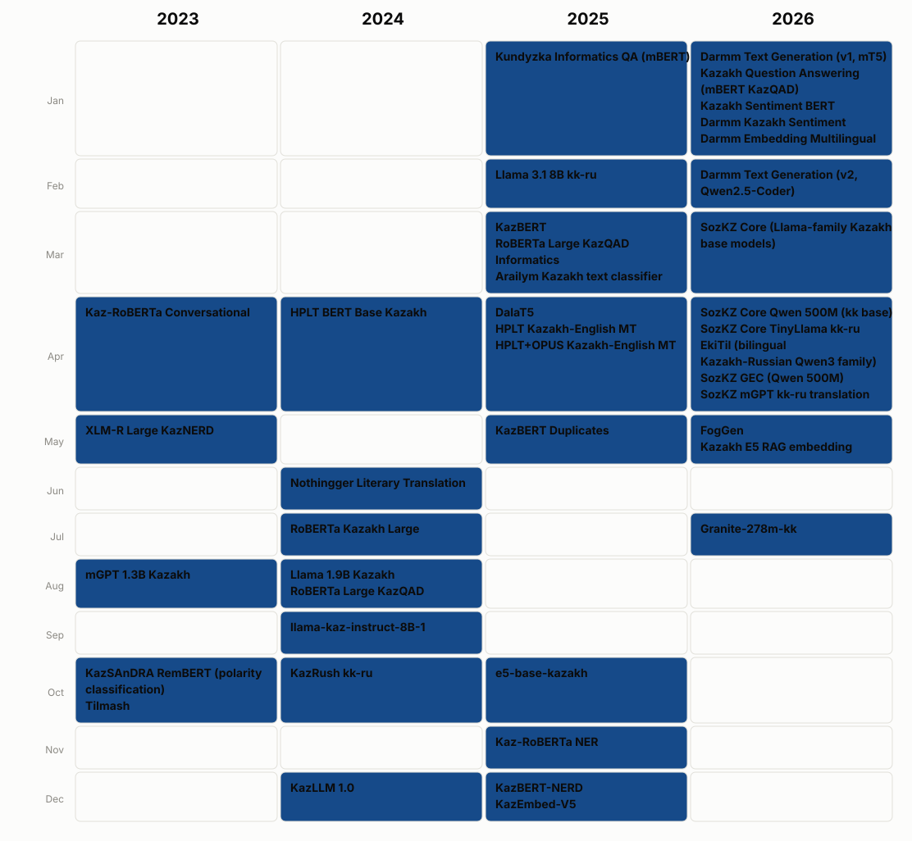
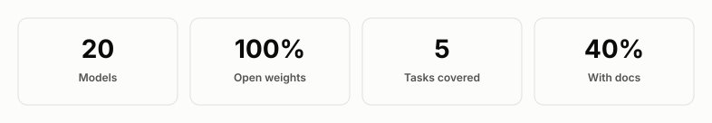
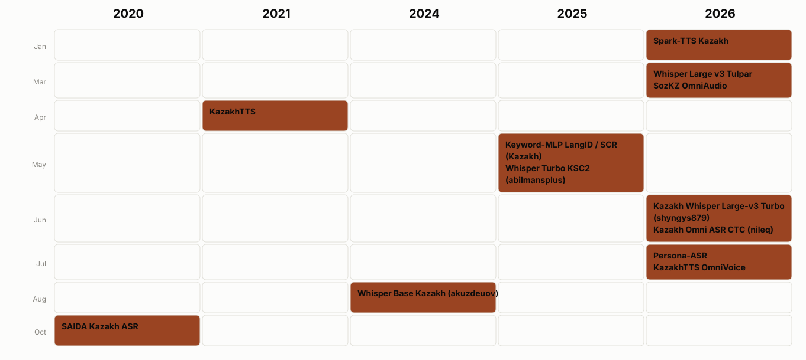
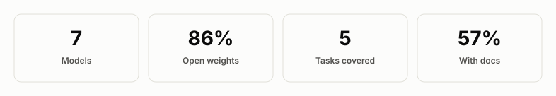
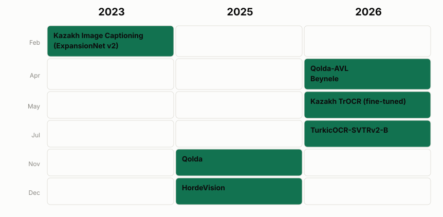

  

<h1 align="center">Awesome Kazakh Models</h1>

  A curated, research-grade catalog of public AI models with substantial
  support for the Kazakh language.

<!-- BADGES:START -->

  
  
  
  

<!-- BADGES:END -->

  <a href="#background">Background</a> ·
  <a href="#model-landscape">Model landscape</a> ·
  <a href="#text-nlp-and-llm">Text &amp; NLP</a> ·
  <a href="#speech-and-audio">Speech</a> ·
  <a href="#vision-ocr-and-multimodal">Vision &amp; OCR</a> ·
  <a href="#watchlist--announced-resources">Watchlist</a> ·
  <a href="#contributing">Contributing</a>

---

## Background

Public Kazakh-capable models are scattered across Hugging Face, GitHub,
institutional pages, and old research repositories, with no single map of what
exists and what is actually obtainable. A search for "Kazakh" on Hugging Face mixes
genuinely Kazakh-trained models with generic multilingual foundations that merely
list `kk` in a tokenizer, quantization/format clones of the same underlying
model, and paper-only experiments with no published weights.

This repository tries to fix that: every entry below is checked against its
primary source (the model's own hosting platform, its official project
repository, or the paper that introduced it), and its release date, license,
access terms, and evidence of Kazakh training or adaptation are recorded rather
than assumed. Quantizations, GGUF/AWQ/GPTQ conversions, and ONNX exports of a
model already listed are not treated as separate entries — the catalog counts
learned model families, not packaging artifacts. Generic multilingual
foundations (mBERT, XLM-R, mT5, vanilla Whisper, NLLB-200, and similar) are
excluded from the main catalog unless Kazakh is a meaningful, identifiable
target of training or adaptation. Resources that are announced, paper-only, or
not yet independently verifiable go in the
[Watchlist](#watchlist--announced-resources) instead of the main tables, so
"listed here" reliably means "you can currently obtain these weights." See
[CHANGELOG.md](CHANGELOG.md) for what's new and what was corrected and why.

In each table, the **Model** name links to the model card or repository, and
the **Author** name links to the paper (or project page, if there's no paper)
when one is available. **Properties** lists parameter count, followed by
architecture/base model. See [CONTRIBUTING.md](CONTRIBUTING.md) for the full
inclusion policy, including the exact meaning of **released**, the access
classification, and family-level deduplication rules.

### Catalog overview

<!-- DASHBOARD:START -->
<picture>
  <source media="(prefers-color-scheme: dark)" srcset="assets/overview_dashboard-dark.svg">
  
</picture>
<!-- DASHBOARD:END -->

## Model landscape

<!-- LANDSCAPE:START -->
<picture>
  <source media="(prefers-color-scheme: dark)" srcset="assets/model_growth-dark.svg">
  
</picture>

**Models per task** — Automatic speech recognition (11) · Large language model (7) · Machine translation (7) · Embeddings / dense retrieval (6) · Text-to-speech (6) · Masked language modelling / encoder (4) · Question answering (4) · OCR (4) · Text generation (3) · Sentiment classification (3) · Named entity recognition (3) · Instruction following (2) · Text classification (2) · Keyword spotting (2) · Vision-language modelling (2) · Image captioning (2) · Transliteration (1) · Grammar correction (1) · POS tagging (1) · Dependency parsing (1) · Language identification (1) · Target-speaker ASR (1) · Audio-vision-language modelling (1) · Text-to-image (1)
<!-- LANDSCAPE:END -->

## Text, NLP, and LLM

<!-- NLP_SECTION:START -->
<picture>
  <source media="(prefers-color-scheme: dark)" srcset="assets/nlp_overview-dark.svg">
  
</picture>

<picture>
  <source media="(prefers-color-scheme: dark)" srcset="assets/nlp_release_calendar-dark.svg">
  
</picture>

**Abbreviations:**

<table width="100%">
<tr><td align="center" valign="middle"><strong>DEP</strong> — Dependency parsing</td><td align="center" valign="middle"><strong>EMB</strong> — Embeddings / dense retrieval</td><td align="center" valign="middle"><strong>GEC</strong> — Grammar correction</td><td align="center" valign="middle"><strong>IF</strong> — Instruction following</td></tr>
<tr><td align="center" valign="middle"><strong>LLM</strong> — Large language model</td><td align="center" valign="middle"><strong>MLM</strong> — Masked language modelling / encoder</td><td align="center" valign="middle"><strong>MT</strong> — Machine translation</td><td align="center" valign="middle"><strong>NER</strong> — Named entity recognition</td></tr>
<tr><td align="center" valign="middle"><strong>POS</strong> — POS tagging</td><td align="center" valign="middle"><strong>QA</strong> — Question answering</td><td align="center" valign="middle"><strong>SC</strong> — Sentiment classification</td><td align="center" valign="middle"><strong>TC</strong> — Text classification</td></tr>
<tr><td align="center" valign="middle"><strong>TG</strong> — Text generation</td><td align="center" valign="middle"><strong>TR</strong> — Transliteration</td><td align="center" valign="middle"></td><td align="center" valign="middle"></td></tr>
</table>

| Released | Model | Description | Author | Properties |
|---|---|---|---|---|
| 2026-07 | **[Granite-278m-kk](https://huggingface.co/Tim2190/granite-278m-kk)** EMB Open · CC-BY-SA-4.0 | IBM Granite multilingual embedding model fine-tuned for Kazakh RAG/retrieval. | **Tim2190** | – 278M – Granite Embedding (base: ibm-granite/granite-embedding-278m-multilingual) |
| 2026-05 | **[FogGen](https://huggingface.co/issai/foggen)** IF Open · Apache-2.0 | ISSAI research family (Qwen3/Gemma3-based, 270M-1.7B) exploring edge-cloud routing, verbalized confidence, and continual learning, trained with Kazakh-culture data. | **[ISSAI researchers](https://issai.nu.edu.kz/)** ISSAI, Nazarbayev University | – 270M-1.7B – Qwen3 / Gemma3 (base: Qwen3 / Gemma3 family) |
| 2026-05 | **[Kazakh E5 RAG embedding](https://huggingface.co/shyngys879/kazakh-e5-rag-embedding)** EMB Open · Not reported | KazEmbed-V5 further fine-tuned for Kazakh RAG/retrieval on a Kazakh Wikipedia RAG dataset. | **shyngys879** | – 278M – XLM-RoBERTa (E5) (base: Nurlykhan/KazEmbed-V5) |
| 2026-04 | **[SozKZ Core Qwen 500M (kk base)](https://huggingface.co/stukenov/sozkz-core-qwen-500m-kk-base-v1)** LLM Open · MIT | Qwen2-architecture Kazakh-only language model trained from scratch by an independent researcher. | **[Saken Tukenov](https://huggingface.co/collections/stukenov/sozkz-core-kazakh-language-models)** | – 447.5M – Qwen2 |
| 2026-04 | **[SozKZ Core TinyLlama kk-ru](https://huggingface.co/stukenov/sozkz-core-tinyllama-1b-kk-ru-v1)** LLM Open · Apache-2.0 | Bilingual Kazakh-Russian continued pretraining of TinyLlama-1.1B via tokenizer extension and progressive multi-stage training. | **Saken Tukenov** | – 1.14B – Llama (TinyLlama) (base: TinyLlama/TinyLlama-1.1B-intermediate-step-1431k-3T) |
| 2026-04 | **[EkiTil (bilingual Kazakh-Russian Qwen3 family)](https://huggingface.co/stukenov/ekitil-core-qwen3-600m-kkru-base-v1)** LLM Open · MIT | Family of Qwen3-architecture bilingual Kazakh-Russian language models trained from scratch, in 123M/300M/600M sizes. | **[Saken Tukenov](https://huggingface.co/collections/stukenov/ekitil-bilingual-kazakh-russian-language-models)** | – 123M-674M – Qwen3 (causal LM, from scratch) |
| 2026-04 | **[SozKZ GEC (Qwen 500M)](https://huggingface.co/stukenov/sozkz-fix-qwen-500m-kk-gec-v4)** GEC Open · MIT | Qwen-architecture 500M model iteratively fine-tuned for Kazakh grammatical error correction, via a preference-optimization pipeline. | **Saken Tukenov** | – 447.5M – Qwen2 (base: sozkz-core-qwen-500m-kk-base) |
| 2026-04 | **[SozKZ mGPT kk-ru translation](https://huggingface.co/stukenov/sozkz-mgpt-1.3b-translate-kkru-v1)** MT Open · MIT | mGPT-1.3B-kazakh further fine-tuned for bilingual Kazakh-Russian translation. | **Saken Tukenov** | – 1.42B – mGPT (base: ai-forever/mGPT-1.3B-kazakh) |
| 2026-03 | **[SozKZ Core (Llama-family Kazakh base models)](https://huggingface.co/stukenov/sozkz-core-llama-1b-kk-base-v1)** LLM Open · MIT | Family of small Llama-architecture Kazakh language models trained from scratch by an independent researcher, ranging from 8M to ≈1.08B parameters. | **[Saken Tukenov](https://huggingface.co/collections/stukenov/sozkz-core-kazakh-language-models)** | – 8M-1.08B (multiple models) – Llama (GQA, from scratch) |
| 2026-02 | **[Darmm Text Generation (v2, Qwen2.5-Coder)](https://huggingface.co/Darmm/darmm-text-generation-kazakh-v2)** TG Open · Apache-2.0 | QLoRA adapter fine-tuning Qwen2.5-Coder-7B-Instruct for Kazakh instruction-following text generation. | **Darmm** | – ≈7B base (QLoRA adapter ≈646MB) – Qwen2.5-Coder (QLoRA adapter) (base: Qwen/Qwen2.5-Coder-7B-Instruct) |
| 2026-01 | **[Darmm Text Generation (v1, mT5)](https://huggingface.co/Darmm/darmm-text-generation-kazakh)** TG Open · Apache-2.0 | mT5-base fine-tuned for Kazakh text generation. | **Darmm** | – 966.6M – mT5 (base: google/mt5-base) |
| 2026-01 | **[Kazakh Question Answering (mBERT KazQAD)](https://huggingface.co/R3iwan/kazakh-question-answering)** QA Open · Apache-2.0 | Multilingual BERT fine-tuned on the KazQAD dataset for extractive question answering in Kazakh. | **Rayvan** | – 177.3M – BERT (multilingual) (base: google-bert/bert-base-multilingual-cased) |
| 2026-01 | **[Kazakh Sentiment BERT](https://huggingface.co/R3iwan/kazakh-sentiment-bert)** SC Open · Apache-2.0 | mBERT fine-tuned for 3-class Kazakh sentiment classification on entertainment reviews. | **R3iwan** | – 177.9M – BERT (multilingual) (base: google-bert/bert-base-multilingual-cased) |
| 2026-01 | **[Darmm Kazakh Sentiment](https://huggingface.co/Darmm/darmm-sentiment-kazakh)** SC Open · Apache-2.0 | mBERT fine-tuned for Kazakh sentiment classification. | **Darmm** | – BERT (multilingual) (base: google-bert/bert-base-multilingual-cased) |
| 2026-01 | **[Darmm Embedding Multilingual](https://huggingface.co/Darmm/darmm-embedding-multilingual)** EMB Open · Apache-2.0 | BGE-M3 fine-tuned for Kazakh/Russian/English multilingual sentence embeddings. | **Darmm** | – 567.8M – BGE-M3 (base: BAAI/bge-m3) |
| 2025-12 | **[KazBERT-NERD](https://huggingface.co/Eraly-ml/KazBERT-NERD)** NER Open · MIT | KazBERT fine-tuned for Kazakh named-entity recognition on KazNERD. | **Eraly-ml** | – 110.1M – BERT (base: Eraly-ml/KazBERT) |
| 2025-12 | **[KazEmbed-V5](https://huggingface.co/Nurlykhan/KazEmbed-V5)** EMB Open · Apache-2.0 | multilingual-e5-base fine-tuned on 61,255 Kazakh pairs (KazQAD, KazQAD-Retrieval, Kazakh dialogue) for retrieval-quality Kazakh embeddings. | **Nurlykhan** | – 278M – XLM-RoBERTa (E5) (base: intfloat/multilingual-e5-base) |
| 2025-11 | **[Kaz-RoBERTa NER](https://huggingface.co/shoplikov/kaz-roberta-ner)** NER Open · CC-BY-4.0 | Kaz-RoBERTa Conversational fine-tuned for Kazakh named-entity recognition on KazNERD. | **shoplikov** | – 82.9M – RoBERTa (base: kz-transformers/kaz-roberta-conversational) |
| 2025-10 | **[e5-base-kazakh](https://huggingface.co/sultanbi/e5-base-kazakh)** EMB Open · MIT | multilingual-e5-base fine-tuned on Kazakh-translated NLI (SNLI) pairs for Kazakh sentence embeddings. | **sultanbi** | – 278M – XLM-RoBERTa (E5) (base: intfloat/multilingual-e5-base) |
| 2025-05 | **[KazBERT Duplicates](https://huggingface.co/Eraly-ml/KazBERT-Duplicates)** TC Open · Apache-2.0 | KazBERT fine-tuned on the KazakhTextDuplicates dataset for semantic duplicate and near-duplicate text detection in Kazakh. | **Yeraly Gainulla** | – 110.6M – BERT (base: Eraly-ml/KazBERT) |
| 2025-04 | **[DalaT5](https://huggingface.co/crossroderick/dalat5)** TR Open · MIT | T5-small fine-tuned for Kazakh Cyrillic-to-Latin transliteration. | **crossroderick** | – 64.6M – T5-small (base: t5-small) |
| 2025-04 | **[HPLT Kazakh-English MT](https://huggingface.co/HPLT/translate-kk-en-v2.0-hplt)** MT Open · CC-BY-4.0 | HPLT project's bidirectional Kazakh-English translation models, trained on HPLT parallel data only. | **HPLT Project** | – Transformer (Marian-style) |
| 2025-04 | **[HPLT+OPUS Kazakh-English MT](https://huggingface.co/HPLT/translate-kk-en-v2.0-hplt_opus)** MT Open · CC-BY-4.0 | HPLT project's bidirectional Kazakh-English translation models, trained on HPLT parallel data augmented with OPUS corpora. | **HPLT Project** | – Transformer (Marian-style) |
| 2025-03 | **[KazBERT](https://huggingface.co/Eraly-ml/KazBERT)** MLM Open · Apache-2.0 | BERT-style masked-language model pretrained with a Kazakh-tailored tokenizer on Kazakh/Russian/English web and Wikipedia text. | **Eraly-ml** | – 110.7M – BERT |
| 2025-03 | **[RoBERTa Large KazQAD Informatics](https://huggingface.co/Arailym-tleubayeva/roberta-large-kazqad-informatics_kaz)** QA Open · Apache-2.0 | RoBERTa Large KazQAD further fine-tuned for informatics/computer-science domain QA in Kazakh. | **Arailym Tleubayeva** | – 354.3M – RoBERTa-large (base: nur-dev/roberta-large-kazqad) |
| 2025-03 | **[Arailym Kazakh text classifier](https://huggingface.co/Arailym-tleubayeva/roberta-kaz-large-small-kazakh-corpus)** TC Open · Apache-2.0 | RoBERTa Kazakh Large fine-tuned for text classification on a curated small Kazakh corpus. | **Arailym Tleubayeva** | – 355.4M – RoBERTa-large (base: nur-dev/roberta-kaz-large) |
| 2025-02 | **[Llama 3.1 8B kk-ru](https://huggingface.co/PolynomeAI/Llama-3.1-8B-kkru)** MT Open · Apache-2.0 | Llama 3.1 8B fine-tuned for bidirectional Russian-Kazakh translation. | **PolynomeAI** | – 8B – Llama 3.1 (base: meta-llama/Llama-3.1-8B) |
| 2025-01 | **[Kundyzka Informatics QA (mBERT)](https://huggingface.co/Kundyzka/bert-base-multilingual-informatics-kaz)** QA Open · Apache-2.0 | mBERT fine-tuned for Kazakh informatics/computer-science question answering. | **Kundyz Maksutova** | – BERT (multilingual) (base: google-bert/bert-base-multilingual-cased) |
| 2024-12 | **[KazLLM 1.0](https://huggingface.co/issai/LLama-3.1-KazLLM-1.0-8B)** LLM Gated · CC-BY-NC-4.0 (with Llama 3.1 Community License terms) | Kazakh-focused Llama 3.1 adaptation released in 8B and 70B variants by ISSAI. | **[ISSAI researchers](https://issai.nu.edu.kz/)** ISSAI, Nazarbayev University | – 8B / 70B – Llama 3.1 (base: Meta Llama 3.1) |
| 2024-10 | **[KazRush kk-ru](https://huggingface.co/deepvk/kazRush-kk-ru)** MT Open · Apache-2.0 | T5-based Kazakh-to-Russian machine translation model trained on KazParC. | **deepvk** | – 197M – T5 |
| 2024-09 | **[llama-kaz-instruct-8B-1](https://huggingface.co/TilQazyna/llama-kaz-instruct-8B-1)** IF Gated · Apache-2.0 | Llama 3 8B continued-pretrained and instruction-tuned for Kazakh by the TilQazyna team. | **TilQazyna** | – 8B – Llama 3 (base: meta-llama/Meta-Llama-3-8B) |
| 2024-08 | **[Llama 1.9B Kazakh](https://huggingface.co/nur-dev/llama-1.9B-kaz)** LLM Open · AFL-3.0 | 1.9B-parameter Llama-architecture model trained from scratch on Kazakh text. | **nur-dev** | – 1.94B – Llama |
| 2024-08 | **[RoBERTa Large KazQAD](https://huggingface.co/nur-dev/roberta-large-kazqad)** QA Open · AFL-3.0 | RoBERTa Kazakh Large fine-tuned for extractive question answering on KazQAD. | **nur-dev** | – 354.3M – RoBERTa-large (base: nur-dev/roberta-kaz-large) |
| 2024-07 | **[RoBERTa Kazakh Large](https://huggingface.co/nur-dev/roberta-kaz-large)** MLM Open · AFL-3.0 | RoBERTa-large trained from scratch on a multidomain Kazakh corpus; serves as the base for several downstream QA/classification fine-tunes in this catalog. | **nur-dev** | – 355.4M – RoBERTa-large |
| 2024-06 | **[Nothingger Literary Translation](https://huggingface.co/Nothingger/kaz-literature-translation)** MT Open · Apache-2.0 | Tilmash fine-tuned on a Kazakh-Russian-English literary parallel corpus for literary-domain translation. | **Nothingger** | – 1.37B – NLLB/M2M100-derived (via Tilmash) (base: issai/tilmash) |
| 2024-04 | **[HPLT BERT Base Kazakh](https://huggingface.co/HPLT/hplt_bert_base_kk)** MLM Open · Apache-2.0 | LTG-BERT-style monolingual encoder for Kazakh, one of many per-language models in the HPLT project's second data/model release. | **HPLT Project** | – ≈153M – LTG-BERT (encoder) |
| 2023-10 | **[KazSAnDRA RemBERT (polarity classification)](https://huggingface.co/issai/rembert-sentiment-analysis-polarity-classification-kazakh)** SC Open · CC-BY-4.0 | RemBERT fine-tuned for Kazakh sentiment polarity classification on the KazSAnDRA review dataset. | **[ISSAI researchers](https://issai.nu.edu.kz/)** ISSAI, Nazarbayev University | – RemBERT (base: google/rembert) |
| 2023-10 | **[Tilmash](https://huggingface.co/issai/tilmash)** MT Gated · Not reported | ISSAI's NLLB-based machine translation model for Kazakh, Russian, English, and Turkish (12 directional pairs), trained on the KazParC corpus. | **[ISSAI researchers](https://arxiv.org/abs/2403.19399)** ISSAI, Nazarbayev University | – NLLB-200-distilled-1.3B (fine-tuned) (base: facebook/nllb-200-distilled-1.3B) |
| 2023-08 | **[mGPT 1.3B Kazakh](https://huggingface.co/ai-forever/mGPT-1.3B-kazakh)** LLM · TG Open · MIT | Multilingual 1.3B GPT model continuously pretrained on Kazakh web and corpus text for 150,000 steps to specialize for Kazakh text generation. | **[AI Forever (Sber AI)](https://arxiv.org/abs/2304.09299)** AI Forever | – 1.3B – mGPT (GPT-2-based multilingual causal LM) (base: ai-forever/mGPT) |
| 2023-05 | **[XLM-R Large KazNERD](https://huggingface.co/yeshpanovrustem/xlm-roberta-large-kaznerd)** NER Open · CC-BY-4.0 | XLM-RoBERTa-large fine-tuned for Kazakh named-entity recognition on KazNERD. | **Rustem Yeshpanov** | – 558.9M – XLM-RoBERTa-large (base: FacebookAI/xlm-roberta-large) |
| 2023-04 | **[Kaz-RoBERTa Conversational](https://huggingface.co/kz-transformers/kaz-roberta-conversational)** MLM Open · Apache-2.0 | RoBERTa-base trained from scratch on a 25GB multidomain Kazakh corpus spanning formal and conversational text. | **kz-transformers** | – 83.5M – RoBERTa |
| 2018 | **[fastText Kazakh word vectors (cc.kk.300)](https://fasttext.cc/docs/en/crawl-vectors.html)** EMB Open · CC-BY-SA-3.0 | CBOW word embeddings with character n-grams trained on Common Crawl and Wikipedia Kazakh text, part of Facebook AI's 157-language release. | **[E. Grave, P. Bojanowski, P. Gupta, A. Joulin, T. Mikolov](https://aclanthology.org/L18-1550/)** Facebook AI Research | – fastText CBOW + character n-grams |
| Unknown | **[Stanza Kazakh pipeline (kk_ktb)](https://stanfordnlp.github.io/stanza/available_models.html)** POS · DEP Open · Apache-2.0 | Stanford Stanza's Kazakh Universal Dependencies pipeline (tokenize/POS/lemma/dependency parsing), trained on the KTB treebank. | **Stanford NLP Group** | – Stanza UD pipeline (biaffine parser + neural taggers) |
<!-- NLP_SECTION:END -->

## Speech and audio

<!-- SPEECH_SECTION:START -->
<picture>
  <source media="(prefers-color-scheme: dark)" srcset="assets/speech_overview-dark.svg">
  
</picture>

<picture>
  <source media="(prefers-color-scheme: dark)" srcset="assets/speech_release_calendar-dark.svg">
  
</picture>

**Abbreviations:**

<table width="100%">
<tr><td align="center" valign="middle"><strong>ASR</strong> — Automatic speech recognition</td><td align="center" valign="middle"><strong>KWS</strong> — Keyword spotting</td><td align="center" valign="middle"><strong>LID</strong> — Language identification</td><td align="center" valign="middle"><strong>TS-ASR</strong> — Target-speaker ASR</td></tr>
<tr><td align="center" valign="middle"><strong>TTS</strong> — Text-to-speech</td><td align="center" valign="middle"></td><td align="center" valign="middle"></td><td align="center" valign="middle"></td></tr>
</table>

| Released | Model | Description | Author | Properties |
|---|---|---|---|---|
| 2026-07 | **[Persona-ASR](https://huggingface.co/issai/Persona-ASR)** TS-ASR Open · CC-BY-4.0 | Bilingual Kazakh-English target-speaker ASR system that transcribes only an enrolled speaker in overlapping/multi-speaker mixtures, rejecting non-target speech. | **ISSAI, Nazarbayev University** | – ECAPA-TDNN + WavLM-Base+ (FiLM-modulated, multi-head CTC) (base: microsoft/wavlm-base-plus) |
| 2026-07 | **[KazakhTTS OmniVoice](https://huggingface.co/shyngys879/KazakhTTS-OmniVoice)** TTS Open · Apache-2.0 | OmniVoice multilingual voice-design and speech-synthesis model fine-tuned on ISSAI KazakhTTS2 and synthetic voice-design data for Kazakh text-to-speech. | **Shyngys Kozhakhmetov** | – 612.6M – OmniVoice (base: k2-fsa/OmniVoice) |
| 2026-06 | **[Kazakh Whisper Large-v3 Turbo (shyngys879)](https://huggingface.co/shyngys879/kazakh-whisper-large-v3-turbo)** ASR Open · Apache-2.0 | Full fine-tune of Whisper Large-v3 Turbo for Kazakh ASR, merged into a standalone Transformers model (no LoRA required), trained on eight public Kazakh speech datasets. | **Shyngys Sovetkhan** | – ≈0.8B – Whisper large-v3-turbo full fine-tune (base: openai/whisper-large-v3-turbo) |
| 2026-06 | **[Kazakh Omni ASR CTC (nileq)](https://huggingface.co/nileq/kazakh-omni-asr-ctc)** ASR Open · Apache-2.0 | Wav2Vec2-style CTC Kazakh ASR model built on the OmniASR/wav2vec2.5-large architecture via the fairseq2/omnilingual-asr framework. | **Nurislam** | – ≈0.3B – Wav2Vec2ForCTC (24 layers, 1024 hidden) |
| 2026-03 | **[Whisper Large v3 Tulpar](https://huggingface.co/olzhasAl/whisper-large-v3-tulpar)** ASR Open · Apache-2.0 | Full fine-tune of Whisper Large v3 for Kazakh ASR, combining ISSAI KSC, Farabi-Lab, FLEURS kk_kz, and curated YouTube audio. | **Olzhas Alseitov** | – 1.55B – Whisper large-v3 full fine-tune (base: openai/whisper-large-v3) |
| 2026-03 | **[SozKZ OmniAudio](https://huggingface.co/stukenov/sozkz-core-omniaudio-70m-kk-asr-v1)** ASR Open · MIT | Family of from-scratch Kazakh ASR models (CTC and encoder-decoder variants) ranging from ≈50M to ≈1B parameters, trained entirely on Kazakh speech with no pretrained components. | **Saken Tukenov** | – 50M-1B (multiple model sizes) – Custom encoder-decoder (Llama-style decoder: RoPE, RMSNorm, SwiGLU) |
| 2026-01 | **[Spark-TTS Kazakh](https://huggingface.co/ErnarBahat/Spark-TTS-Kazakh)** TTS Open · CC-BY-NC-SA-4.0 | Kazakh fine-tune of Spark-TTS supporting both Cyrillic and Töte Zhazu (Latin-based) script input, with voice cloning from 3-10 seconds of reference audio. | **ErnarBahat** | – Spark-TTS (BiCodec + LLM inference engine) (base: SparkAudio/Spark-TTS-0.5B) |
| 2025-05 | **[Keyword-MLP LangID / SCR (Kazakh)](https://huggingface.co/artur-muratov/kw-mlp-mono-kk)** KWS · LID Open · Not reported | Unified multitask Keyword-MLP model performing speech command recognition and language identification, with a dedicated Kazakh-only model alongside multilingual LangID variants. | **Artur Muratov** ISSAI, Nazarbayev University | – Keyword-MLP (multitask SCR + LangID) |
| 2025-05 | **[Whisper Turbo KSC2 (abilmansplus)](https://huggingface.co/abilmansplus/whisper-turbo-ksc2)** ASR Open · MIT | Whisper Large-v3-Turbo fine-tuned for Kazakh ASR on KSC2, with a bilingual Kazakh-Russian LoRA adapter variant built on top of it. | **abilmansplus** | – ≈0.8B – Whisper large-v3-turbo full fine-tune + LoRA adapter (base: openai/whisper-large-v3-turbo) |
| 2024-08 | **[Whisper Base Kazakh (akuzdeuov)](https://huggingface.co/akuzdeuov/whisper-base.kk)** ASR Open · Apache-2.0 | Whisper base fine-tuned for Kazakh ASR on the KSC2 corpus. | **akuzdeuov** | – ≈74M – Whisper base fine-tune (base: openai/whisper-base) |
| 2024 | **[KazEmoTTS](https://github.com/IS2AI/KazEmoTTS)** TTS Open · Not reported | Emotional text-to-speech model for Kazakh (six emotion categories) using Grad-TTS with a HiFi-GAN vocoder. | **ISSAI, Nazarbayev University** | – Grad-TTS + HiFi-GAN vocoder |
| 2023 | **[TurkicASR](https://github.com/IS2AI/TurkicASR)** ASR Open · CC-BY-4.0 | Multilingual ESPnet Transformer ASR system covering ten Turkic languages including Kazakh, released as joint "Turkic languages" and "all languages" downloadable archives. | **[Mussakhojayeva et al.](https://www.mdpi.com/2078-2489/14/2/74)** ISSAI, Nazarbayev University | – ESPnet Transformer, multilingual joint training |
| 2023 | **[Multilingual Speech Command Recognition (Keyword-MLP)](https://github.com/IS2AI/Multilingual-Speech-Command-Recognition)** KWS Open · MIT | Keyword-MLP keyword-spotting classifier with a dedicated Kazakh monolingual model (Mono-35-kk) plus multilingual Kazakh/Tatar/Russian variants, for voice-controlled robotics and smart systems. | **ISSAI, Nazarbayev University** | – Keyword-MLP classifier |
| 2023 | **[TurkicTTS](https://github.com/IS2AI/TurkicTTS)** TTS Open · Not reported | Cross-Turkic TTS system whose acoustic model is trained solely on Kazakh data and extended to nine other Turkic languages via IPA-based transliteration. | **[Yeshpanov et al.](https://arxiv.org/abs/2305.15749)** ISSAI, Nazarbayev University | – Tacotron2 + ParallelWaveGAN (IPA-based cross-lingual transliteration) |
| 2022 | **[KSC2 Kazakh ASR (best-performing model)](https://github.com/IS2AI/Kazakh_ASR)** ASR Open · Not reported | ESPnet Transformer ASR model with language-model rescoring, trained on the large-scale KSC2 Kazakh speech corpus; the best-performing model from the KSC2 paper. | **[Mussakhojayeva et al.](https://www.isca-archive.org/interspeech_2022/mussakhojayeva22_interspeech.pdf)** ISSAI, Nazarbayev University | – ESPnet Transformer ASR + language model rescoring |
| 2021-04 | **[KazakhTTS](https://github.com/IS2AI/Kazakh_TTS)** TTS Open · CC-BY-4.0 | Open-source Kazakh text-to-speech acoustic and vocoder models, later expanded by the KazakhTTS2 corpus/models. | **[Mussakhojayeva et al.](https://arxiv.org/abs/2104.08459)** ISSAI, Nazarbayev University | – Tacotron2 / FastSpeech acoustic models + Parallel WaveGAN vocoders |
| 2021 | **[IS2AI Multilingual ASR (Kazakh-Russian-English)](https://github.com/IS2AI/MultilingualASR)** ASR Open · Not reported | Large Transformer ASR system with monolingual Kazakh, Russian, and English variants plus combined/independent multilingual variants, from the ISSAI multilingual ASR study. | **ISSAI, Nazarbayev University** | – Large Transformer (ESPnet) |
| 2021 | **[Wav2Vec2-Large-XLSR-53 Kazakh](https://huggingface.co/aismlv/wav2vec2-large-xlsr-kazakh)** ASR Open · Apache-2.0 | Community fine-tune of wav2vec2-large-XLSR-53 for Kazakh CTC ASR, produced during Hugging Face's 2021 XLSR Fine-Tuning Week. | **aismlv** | – ≈0.3B – wav2vec2-large-XLSR-53 fine-tune (CTC) (base: facebook/wav2vec2-large-xlsr-53) |
| 2020-10 | **[SAIDA Kazakh ASR](https://issai.nu.edu.kz/wp-content/uploads/2020/10/model.tar.gz)** ASR Open · CC-BY-4.0 | ESPnet Transformer ASR baseline released with the original Kazakh Speech Corpus (KSC), one of the first open Kazakh ASR models. | **[Mussakhojayeva et al.](https://arxiv.org/abs/2009.10334)** ISSAI, Nazarbayev University | – ESPnet Transformer encoder-decoder ASR |
| Unknown | **[Piper Kazakh Voices](https://huggingface.co/rhasspy/piper-voices/tree/main/kk/kk_KZ)** TTS Open · CC-BY-4.0 | Three official Kazakh (kk_KZ) voices — iseke, issai, raya — in the Piper/VITS neural TTS voice catalog, trained from scratch on the IS2AI KazakhTTS dataset. | Not reported | – VITS (Piper) |
<!-- SPEECH_SECTION:END -->

## Vision, OCR, and multimodal

<!-- VISION_SECTION:START -->
<picture>
  <source media="(prefers-color-scheme: dark)" srcset="assets/vision_overview-dark.svg">
  
</picture>

<picture>
  <source media="(prefers-color-scheme: dark)" srcset="assets/cv_release_calendar-dark.svg">
  
</picture>

**Abbreviations:**

<table width="100%">
<tr><td align="center" valign="middle"><strong>AVL</strong> — Audio-vision-language modelling</td><td align="center" valign="middle"><strong>IC</strong> — Image captioning</td><td align="center" valign="middle"><strong>OCR</strong> — OCR</td><td align="center" valign="middle"><strong>T2I</strong> — Text-to-image</td></tr>
<tr><td align="center" valign="middle"><strong>VLM</strong> — Vision-language modelling</td><td align="center" valign="middle"></td><td align="center" valign="middle"></td><td align="center" valign="middle"></td></tr>
</table>

| Released | Model | Description | Author | Properties |
|---|---|---|---|---|
| 2026-07 | **[TurkicOCR-SVTRv2-B](https://huggingface.co/alenisaw/turkicocr-svtrv2-b)** OCR Open · Apache-2.0 | Lightweight (≈35M-parameter) line-grounded OCR recognizer for Kazakh and Kyrgyz Cyrillic script (plus Russian mixed text), built on SVTRv2-B with a CTC head. | **Issayev & Zhalgas** | – ≈35M – SVTRv2-B (OpenOCR) + CTC (base: OpenOCR/SVTRv2-B) |
| 2026-05 | **[Kazakh TrOCR (fine-tuned)](https://huggingface.co/thekamilya/kazakh-trocr-fine-tuned)** OCR Open · Apache-2.0 | TrOCR vision-encoder-decoder model fine-tuned specifically for Kazakh printed-text OCR, adapted from a Russian-handwritten TrOCR model with token embeddings resized for nine Kazakh-specific Cyrillic letters. | **Kamilya Nazarkhanova** | – ≈334M – VisionEncoderDecoder (TrOCR) (base: kazars24/trocr-base-handwritten-ru) |
| 2026-04 | **[Qolda-AVL](https://huggingface.co/collections/issai/qolda-avl)** AVL Open · Apache-2.0 | Audio-vision-language extension of Qwen3-VL adding a fine-tuned Whisper encoder and audio-projection module, with all three modalities adapted to Kazakh. Released as 5B/9B/34B variants sharing one architecture and training recipe. | **ISSAI, Nazarbayev University** | – 5B / 9B / 34B – Qwen3-VL-Thinking + Whisper-large-v3-turbo (DeepStack audio projection) (base: Qwen3-VL-Thinking + openai/whisper-large-v3-turbo) |
| 2026-04 | **[Beynele](https://huggingface.co/issai/Beynele)** T2I Open · Apache-2.0 | Lumina-Image 2.0-based text-to-image diffusion transformer adapted for Kazakh-language prompts and Kazakh cultural visual content via a data-centric fine-tuning pipeline. | **Aikyn et al.** ISSAI, Nazarbayev University | – ≈2.6B – Lumina-Image 2.0 (flow-based diffusion transformer) (base: Alpha-VLLM/Lumina-Image-2.0 + google/gemma-2-2b) |
| 2025-12 | **[HordeVision](https://huggingface.co/kz-transformers/horde-vision)** OCR · IC · VLM Gated · Apache-2.0 | Kazakh vision-language model built on a 4-bit-quantized Qwen3-VL-8B-Instruct, fine-tuned via SFT + GRPO on roughly 50,000 culturally relevant Kazakh images for OCR, captioning, VQA, reasoning, and instruction-following. | **[Zubitskii et al.](https://www.techrxiv.org/users/968774/articles/1376502-hordevision-an-open-source-kazakh-vision-language-model)** kz-transformers | – ≈8.8B (4-bit quantized) – Qwen3-VL-8B-Instruct (4-bit) + LoRA SFT + GRPO (base: Qwen/Qwen3-VL-8B-Instruct) |
| 2025-11 | **[Qolda](https://huggingface.co/issai/Qolda)** VLM · OCR Open · Apache-2.0 | Compact vision-language model combining InternVL3.5's InternViT-300M encoder/projector with a Qwen3-4B language model, explicitly trained and evaluated for Kazakh alongside Russian and English. | **ISSAI, Nazarbayev University** | – ≈4.3B – InternViT-300M + MLP projector (from InternVL3.5-4B) + Qwen3-4B (base: OpenGVLab/InternVL3_5-4B + Qwen/Qwen3-4B) |
| 2023-02 | **[Kazakh Image Captioning (ExpansionNet v2)](https://github.com/IS2AI/kaz-image-captioning)** IC Open · Not reported | ExpansionNet v2 image-captioning model fine-tuned to generate Kazakh-language captions, trained on COCO images with captions machine-translated into Kazakh. | **[Arystanbekov et al.](https://www.techrxiv.org/articles/preprint/Image_Captioning_for_the_Visually_Impaired_and_Blind_A_Recipe_for_Low-Resource_Languages/22133894)** IS2AI, Nazarbayev University | – ExpansionNet v2 |
<!-- VISION_SECTION:END -->

## Watchlist / announced resources

Resources below are announced, described in a paper without a public artifact,
of unclear provenance, or not yet independently verifiable as substantively
Kazakh-trained models. They are intentionally **not** part of the main catalog
above, but could plausibly still qualify once verification succeeds.

<!-- WATCHLIST:START -->
- **Söyle** — The IS2AI GitHub repository and its ICAIIC 2024 paper are real, but the only pretrained-model link in the README (`dhcppc0/soyle_onnx` on Hugging Face) resolves to a 404. The official ISSAI project page links the code and a companion dataset but no model under the `issai` org — currently training-code-only, the same pattern as the official KazNERD repository.
- **Tencent Kazakh 7B Adapter (HY-MT1.5-7B LoRA)** — A real paper — "Script Correction and Synthetic Pivoting: Adapting Tencent HY-MT for Low-Resource Turkic Translation" (LoResMT 2026, ru-kk track) — describes a LoRA fine-tune of Tencent HY-MT1.5-7B, but no public download for the trained LoRA weights could be found in the paper or via search.
- **AIT-ASR** — A Whisper-small Kazakh ASR fine-tune (`nur-dev/ait-asr`) is hosted on Hugging Face, but has not yet been through a properly scoped primary-source verification pass for this catalog.
- **AIT-Syn Kazakh TTS** — A Qwen3-TTS-based Kazakh voice-cloning model (`nur-dev/ait-syn-4L`) exists on Hugging Face, but has not yet received a dedicated primary-source verification pass.
- **facebook/mms-tts-kaz** — Meta's Massively Multilingual Speech project includes a per-language Kazakh TTS model, but the exact current artifact, license terms, and specifically Kazakh training evidence (MMS covers 1000+ languages) have not yet been independently re-verified.
<!-- WATCHLIST:END -->

## Inclusion and maintenance

Main-catalog inclusion requires a currently obtainable trained model artifact
and identifiable evidence that Kazakh is a meaningful training or evaluation
target — not just a listed tokenizer language. Generic multilingual
foundations are excluded unless a Kazakh-specific adaptation exists.
Quantizations, format conversions, and deployment exports of an already-listed
model are not counted as separate entries. Full inclusion, exclusion, and
verification rules are in [CONTRIBUTING.md](CONTRIBUTING.md).

## Contributing

Missing a Kazakh model, or spotted outdated metadata? Contributions are welcome:

- **Add a model** — [open a submission issue](../../issues/new?template=model-submission.yml)
  or send a PR directly.
- **Fix or update an entry** — edit `data/models.yaml` and open a PR.
- **Report a stale number** — Hugging Face download/like counts drift; flag it
  with the current value, though note the catalog does not treat these as
  intrinsic model properties.

See [CONTRIBUTING.md](CONTRIBUTING.md) for the full inclusion criteria, required
metadata, and PR format.

## Acknowledgements

This project was inspired by [Allessyer/awesome-kaz-datasets](https://github.com/Allessyer/awesome-kaz-datasets). Thanks to its author and contributors for helping establish a public catalog of Kazakh-language AI resources.

