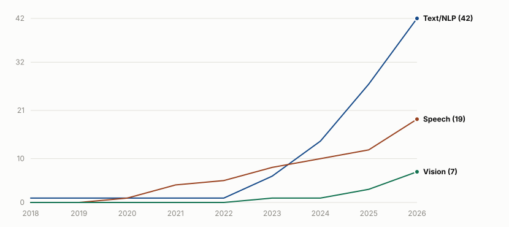

<h1 align="center">
  
  Awesome Kazakh Models
  
</h1>

  A curated, research-grade catalog of public AI models with substantial support for the Kazakh language.

<!-- BADGES:START -->

  
  
  
  

<!-- BADGES:END -->

  <a href="#about">About</a> ·
  <a href="#text-nlp-and-llm">Text &amp; NLP</a> ·
  <a href="#speech-and-audio">Speech</a> ·
  <a href="#vision-ocr-and-multimodal">Vision &amp; OCR</a> ·
  <a href="#watchlist--announced-resources">Watchlist</a> ·
  <a href="#contributing">Contributing</a> ·
  <a href="#license">License</a>

> ### ✨ Explore Kazakh datasets across every domain — [awesome-kaz-datasets](https://github.com/Allessyer/awesome-kaz-datasets)

---

## About

Public Kazakh-capable models are scattered across Hugging Face, GitHub, and
institutional pages, with no reliable map of what's actually obtainable
today. A search for "Kazakh" mixes genuinely Kazakh-trained models with
generic multilingual foundations, packaging clones of the same checkpoint,
and paper-only experiments with no published weights.

Every entry below is checked against its primary source, with release date,
license, access terms, and evidence of Kazakh training recorded rather than
assumed. Resources that are announced or not yet independently verifiable go
in the [Watchlist](#watchlist--announced-resources) instead of the main
tables. See [CONTRIBUTING.md](CONTRIBUTING.md) for the full inclusion policy
and [CHANGELOG.md](CHANGELOG.md) for what's new.

<!-- LANDSCAPE:START -->
<picture>
  <source media="(prefers-color-scheme: dark)" srcset="assets/model_growth-dark.svg">
  
</picture>

Cumulative Kazakh model-family releases over time, by section.
<!-- LANDSCAPE:END -->

## Text, NLP, and LLM

<!-- NLP_SECTION:START -->
| ID | Released | Model | Task | Description | Storage | Parameters |
|---:|---|---|---|---|---|---|
| 1 | 2026-08 | **[ISSAI Qwen3.5 Kazakh](https://huggingface.co/issai/Qwen3.5-35B-A3B-Kazakh)** [ISSAI researchers](https://issai.nu.edu.kz/) Open | LLM · IF | ISSAI's Kazakh adaptation of Qwen3.5 (4B/9B/35B-A3B), combining tokenizer-extended continued pretraining with a chat-vector merge that restores the official instruct alignment. | 70.3 GB | – 4B / 9B / 35B-A3B (MoE) – Qwen3.5 (dense 4B/9B; MoE 35B-A3B), continued-pretrained then chat-vector merged with the official instruct model (base: Qwen/Qwen3.5 family (4B / 9B / 35B-A3B)) |
| 2 | 2026-08 | **[Qwen3.8-27B Kazakh SFT (Tohirju)](https://huggingface.co/Tohirju/qwen38-27b-kazakh-sft)** Tohir Saidzoda Gated | IF | Kazakh instruction/tool-use fine-tune family (SFT, tool-calling, and GRPO-refined tool-calling variants) of a ~27B Qwen-architecture model, part of a multi-language (Tajik/Uzbek/Kyrgyz/Kazakh) fine-tune series by the same author. | 53.8 GB | – ≈26.9B – Qwen3.5-family text architecture (~27B; exact upstream base checkpoint undisclosed) |
| 3 | 2026-07 | **[Granite-278m-kk](https://huggingface.co/Tim2190/granite-278m-kk)** Tim2190 Open | EMB | IBM Granite multilingual embedding model fine-tuned for Kazakh RAG/retrieval. | 556.1 MB | – 278M – Granite Embedding (base: ibm-granite/granite-embedding-278m-multilingual) |
| 4 | 2026-07 | **[Kimi-K3-0.40B Kazakh CPT (59M tokens)](https://huggingface.co/Eraly-ml/Kimi-K3-0.40B-Kazakh-CPT-59M)** Yeraly Gainulla Open | LLM | Experimental hybrid KDA+MLA+MoE Kimi-K3 checkpoint continued-pretrained on Kazakh text, having seen roughly 59 million cumulative Kazakh tokens. | 791.2 MB | – 395.6M – Kimi K3 (hybrid KDA + MLA + MoE, 8 layers, 8 routed experts top-2 + 1 shared expert) (base: inference-optimization/Kimi-K3-0.40B) |
| 5 | 2026-06 | **[Kazakh Morphological Analysis (QazCorpora ensemble)](https://huggingface.co/TilQazyna/kazakh-morpho-qazcorpora)** TilQazyna Gated | MORPH | Ensemble of trained classifiers and small PyTorch lemmatization networks for Kazakh morphological analysis (part-of-speech attribute prediction and lemmatization), evaluated on the QazCorpora corpus. | 11.2 MB | – Ensemble: scikit-learn classifiers/vectorizers (joblib) for morphological attribute tagging plus small PyTorch feed-forward networks for lemma suffix/rule prediction |
| 6 | 2026-05 | **[FogGen](https://huggingface.co/issai/foggen)** [ISSAI researchers](https://issai.nu.edu.kz/) Open | IF | ISSAI research family (Qwen3/Gemma3-based, 270M-1.7B) exploring edge-cloud routing, verbalized confidence, and continual learning, trained with Kazakh-culture data. | 1.2 GB | – 270M-1.7B – Qwen3 / Gemma3 (base: Qwen3 / Gemma3 family) |
| 7 | 2026-05 | **[Kazakh E5 RAG embedding](https://huggingface.co/shyngys879/kazakh-e5-rag-embedding)** shyngys879 Open | EMB | KazEmbed-V5 further fine-tuned for Kazakh RAG/retrieval on a Kazakh Wikipedia RAG dataset. | 1.1 GB | – 278M – XLM-RoBERTa (E5) (base: Nurlykhan/KazEmbed-V5) |
| 8 | 2026-04 | **[SozKZ Core Qwen 500M (kk base)](https://huggingface.co/stukenov/sozkz-core-qwen-500m-kk-base-v1)** [Saken Tukenov](https://huggingface.co/collections/stukenov/sozkz-core-kazakh-language-models) Gated | LLM | Qwen2-architecture Kazakh-only language model trained from scratch by an independent researcher. | 895.0 MB | – 447.5M – Qwen2 |
| 9 | 2026-04 | **[SozKZ Core TinyLlama kk-ru](https://huggingface.co/stukenov/sozkz-core-tinyllama-1b-kk-ru-v1)** Saken Tukenov Gated | LLM | Bilingual Kazakh-Russian continued pretraining of TinyLlama-1.1B via tokenizer extension and progressive multi-stage training. | 2.3 GB | – 1.14B – Llama (TinyLlama) (base: TinyLlama/TinyLlama-1.1B-intermediate-step-1431k-3T) |
| 10 | 2026-04 | **[EkiTil (bilingual Kazakh-Russian Qwen3 family)](https://huggingface.co/stukenov/ekitil-core-qwen3-600m-kkru-base-v1)** [Saken Tukenov](https://huggingface.co/collections/stukenov/ekitil-bilingual-kazakh-russian-language-models) Gated | LLM | Family of Qwen3-architecture bilingual Kazakh-Russian language models trained from scratch, in 123M/300M/600M sizes. | 2.7 GB | – 123M-674M – Qwen3 (causal LM, from scratch) |
| 11 | 2026-04 | **[SozKZ GEC (Qwen 500M)](https://huggingface.co/stukenov/sozkz-fix-qwen-500m-kk-gec-v4)** Saken Tukenov Gated | GEC | Qwen-architecture 500M model iteratively fine-tuned for Kazakh grammatical error correction, via a preference-optimization pipeline. | 895.0 MB | – 447.5M – Qwen2 (base: sozkz-core-qwen-500m-kk-base) |
| 12 | 2026-04 | **[SozKZ mGPT kk-ru translation](https://huggingface.co/stukenov/sozkz-mgpt-1.3b-translate-kkru-v1)** Saken Tukenov Gated | MT | mGPT-1.3B-kazakh further fine-tuned for bilingual Kazakh-Russian translation. | 2.8 GB | – 1.42B – mGPT (base: ai-forever/mGPT-1.3B-kazakh) |
| 13 | 2026-04 | **[SozKZ NLLB-1B Kazakh GEC](https://huggingface.co/stukenov/sozkz-nllb-1b-kk-gec-v1)** [Saken Tukenov](https://huggingface.co/collections/stukenov/sozkz-core-kazakh-language-models) Gated | GEC | NLLB-200-1.3B fine-tuned for Kazakh grammatical error correction (spelling, morphology, punctuation, word order), trained in a two-stage pretrain-then-finetune pipeline on synthetic and mixed GEC corpora. | 2.78 GB | – 1.37B – NLLB-200-1.3B (M2M100ForConditionalGeneration) (base: facebook/nllb-200-1.3B) |
| 14 | 2026-03 | **[SozKZ Core (Llama-family Kazakh base models)](https://huggingface.co/stukenov/sozkz-core-llama-1b-kk-base-v1)** [Saken Tukenov](https://huggingface.co/collections/stukenov/sozkz-core-kazakh-language-models) Gated | LLM | Family of small Llama-architecture Kazakh language models trained from scratch by an independent researcher, ranging from 8M to ≈1.08B parameters. | 2.2 GB | – 8M-1.08B (multiple models) – Llama (GQA, from scratch) |
| 15 | 2026-02 | **[Darmm Text Generation (v2, Qwen2.5-Coder)](https://huggingface.co/Darmm/darmm-text-generation-kazakh-v2)** Darmm Open | TG | QLoRA adapter fine-tuning Qwen2.5-Coder-7B-Instruct for Kazakh instruction-following text generation. | 646.0 MB | – ≈7B base (QLoRA adapter ≈646MB) – Qwen2.5-Coder (QLoRA adapter) (base: Qwen/Qwen2.5-Coder-7B-Instruct) |
| 16 | 2026-02 | **[Tencent Kazakh 7B Adapter](https://huggingface.co/Defetya/tencent-kazakh-7b-adapter)** Defetya Open | MT | LoRA adapter for tencent/HY-MT1.5-7B that outputs Kazakh in Cyrillic script (the base model defaults to Arabic script) for Russian-to-Kazakh translation. | 54.6 MB | – LoRA adapter over tencent/HY-MT1.5-7B (base: tencent/HY-MT1.5-7B) |
| 17 | 2026-01 | **[Darmm Text Generation (v1, mT5)](https://huggingface.co/Darmm/darmm-text-generation-kazakh)** Darmm Open | TG | mT5-base fine-tuned for Kazakh text generation. | 3.9 GB | – 966.6M – mT5 (base: google/mt5-base) |
| 18 | 2026-01 | **[Kazakh Question Answering (mBERT KazQAD)](https://huggingface.co/R3iwan/kazakh-question-answering)** Rayvan Open | QA | Multilingual BERT fine-tuned on the KazQAD dataset for extractive question answering in Kazakh. | 709.1 MB | – 177.3M – BERT (multilingual) (base: google-bert/bert-base-multilingual-cased) |
| 19 | 2026-01 | **[Kazakh Sentiment BERT](https://huggingface.co/R3iwan/kazakh-sentiment-bert)** R3iwan Open | SC | mBERT fine-tuned for 3-class Kazakh sentiment classification on entertainment reviews. | 711.4 MB | – 177.9M – BERT (multilingual) (base: google-bert/bert-base-multilingual-cased) |
| 20 | 2026-01 | **[Darmm Kazakh Sentiment](https://huggingface.co/Darmm/darmm-sentiment-kazakh)** Darmm Open | SC | mBERT fine-tuned for Kazakh sentiment classification. | 711.5 MB | – ≈177.9M – BERT (multilingual) (base: google-bert/bert-base-multilingual-cased) |
| 21 | 2026-01 | **[Darmm Embedding Multilingual](https://huggingface.co/Darmm/darmm-embedding-multilingual)** Darmm Open | EMB | BGE-M3 fine-tuned for Kazakh/Russian/English multilingual sentence embeddings. | 2.3 GB | – 567.8M – BGE-M3 (base: BAAI/bge-m3) |
| 22 | 2026-01 | **[Qwen2.5-3B History of Kazakhstan](https://huggingface.co/rsyrlybay/qwen2.5-3b-history-kazakhstan)** Ramazan Syrlybay Open | QA | Qwen2.5-3B QLoRA-fine-tuned on an 11th-grade Kazakhstan history textbook for Kazakh/Russian/English question answering. | 6.2 GB | – ≈3.09B – Qwen2.5 (QLoRA fine-tune, merged) (base: Qwen/Qwen2.5-3B) |
| 23 | 2025-12 | **[KazBERT-NERD](https://huggingface.co/Eraly-ml/KazBERT-NERD)** Eraly-ml Open | NER | KazBERT fine-tuned for Kazakh named-entity recognition on KazNERD. | 440.3 MB | – 110.1M – BERT (base: Eraly-ml/KazBERT) |
| 24 | 2025-12 | **[KazEmbed-V5](https://huggingface.co/Nurlykhan/KazEmbed-V5)** Nurlykhan Open | EMB | multilingual-e5-base fine-tuned on 61,255 Kazakh pairs (KazQAD, KazQAD-Retrieval, Kazakh dialogue) for retrieval-quality Kazakh embeddings. | 1.1 GB | – 278M – XLM-RoBERTa (E5) (base: intfloat/multilingual-e5-base) |
| 25 | 2025-11 | **[Kaz-RoBERTa NER](https://huggingface.co/shoplikov/kaz-roberta-ner)** shoplikov Open | NER | Kaz-RoBERTa Conversational fine-tuned for Kazakh named-entity recognition on KazNERD. | 331.6 MB | – 82.9M – RoBERTa (base: kz-transformers/kaz-roberta-conversational) |
| 26 | 2025-11 | **[XLM-RoBERTa Kazakh POS Tagger (TilQazyna)](https://huggingface.co/TilQazyna/xlm-roberta-kazakh-pos)** TilQazyna Gated | POS | XLM-RoBERTa fine-tuned for Kazakh part-of-speech tagging, with per-tag performance and confusion-matrix evaluation artifacts included in the repo. | 1.1 GB | – ≈278.1M – XLM-RoBERTa (token classification) (base: FacebookAI/xlm-roberta-base) |
| 27 | 2025-10 | **[e5-base-kazakh](https://huggingface.co/sultanbi/e5-base-kazakh)** sultanbi Open | EMB | multilingual-e5-base fine-tuned on Kazakh-translated NLI (SNLI) pairs for Kazakh sentence embeddings. | 1.1 GB | – 278M – XLM-RoBERTa (E5) (base: intfloat/multilingual-e5-base) |
| 28 | 2025-05 | **[KazBERT Duplicates](https://huggingface.co/Eraly-ml/KazBERT-Duplicates)** Yeraly Gainulla Open | TC | KazBERT fine-tuned on the KazakhTextDuplicates dataset for semantic duplicate and near-duplicate text detection in Kazakh. | 442.5 MB | – 110.6M – BERT (base: Eraly-ml/KazBERT) |
| 29 | 2025-04 | **[DalaT5](https://huggingface.co/crossroderick/dalat5)** crossroderick Open | TR | T5-small fine-tuned for Kazakh Cyrillic-to-Latin transliteration. | 258.4 MB | – 64.6M – T5-small (base: t5-small) |
| 30 | 2025-04 | **[HPLT Kazakh-English MT](https://huggingface.co/HPLT/translate-kk-en-v2.0-hplt)** HPLT Project Open | MT | HPLT project's bidirectional Kazakh-English translation models, trained on HPLT parallel data only. | 615.9 MB | – Transformer (Marian-style) |
| 31 | 2025-04 | **[HPLT+OPUS Kazakh-English MT](https://huggingface.co/HPLT/translate-kk-en-v2.0-hplt_opus)** HPLT Project Open | MT | HPLT project's bidirectional Kazakh-English translation models, trained on HPLT parallel data augmented with OPUS corpora. | 615.9 MB | – Transformer (Marian-style) |
| 32 | 2025-03 | **[KazBERT](https://huggingface.co/Eraly-ml/KazBERT)** Eraly-ml Open | MLM | BERT-style masked-language model pretrained with a Kazakh-tailored tokenizer on Kazakh/Russian/English web and Wikipedia text. | 442.6 MB | – 110.7M – BERT |
| 33 | 2025-03 | **[RoBERTa Large KazQAD Informatics](https://huggingface.co/Arailym-tleubayeva/roberta-large-kazqad-informatics_kaz)** Arailym Tleubayeva Open | QA | RoBERTa Large KazQAD further fine-tuned for informatics/computer-science domain QA in Kazakh. | 1.4 GB | – 354.3M – RoBERTa-large (base: nur-dev/roberta-large-kazqad) |
| 34 | 2025-03 | **[Arailym Kazakh text classifier](https://huggingface.co/Arailym-tleubayeva/roberta-kaz-large-small-kazakh-corpus)** Arailym Tleubayeva Open | TC | RoBERTa Kazakh Large fine-tuned for text classification on a curated small Kazakh corpus. | 1.4 GB | – 355.4M – RoBERTa-large (base: nur-dev/roberta-kaz-large) |
| 35 | 2025-02 | **[Llama 3.1 8B kk-ru](https://huggingface.co/PolynomeAI/Llama-3.1-8B-kkru)** PolynomeAI Open | MT | Llama 3.1 8B fine-tuned for bidirectional Russian-Kazakh translation. | 27.3 MB | – 8B – Llama 3.1 (base: meta-llama/Llama-3.1-8B) |
| 36 | 2025-01 | **[Kundyzka Informatics QA (mBERT)](https://huggingface.co/Kundyzka/bert-base-multilingual-informatics-kaz)** Kundyz Maksutova Open | QA | mBERT fine-tuned for Kazakh informatics/computer-science question answering. | Not reported | – BERT (multilingual) (base: google-bert/bert-base-multilingual-cased) |
| 37 | 2024-12 | **[KazLLM 1.0](https://huggingface.co/issai/LLama-3.1-KazLLM-1.0-8B)** [ISSAI researchers](https://issai.nu.edu.kz/) Gated | LLM | Kazakh-focused Llama 3.1 adaptation released in 8B and 70B variants by ISSAI. | 16.1 GB | – 8B / 70B – Llama 3.1 (base: Meta Llama 3.1) |
| 38 | 2024-10 | **[KazRush kk-ru](https://huggingface.co/deepvk/kazRush-kk-ru)** deepvk Open | MT | T5-based Kazakh-to-Russian machine translation model trained on KazParC. | 787.9 MB | – 197M – T5 |
| 39 | 2024-09 | **[llama-kaz-instruct-8B-1](https://huggingface.co/TilQazyna/llama-kaz-instruct-8B-1)** TilQazyna Gated | IF | Llama 3 8B continued-pretrained and instruction-tuned for Kazakh by the TilQazyna team. | 16.1 GB | – 8B – Llama 3 (base: meta-llama/Meta-Llama-3-8B) |
| 40 | 2024-08 | **[Llama 1.9B Kazakh](https://huggingface.co/nur-dev/llama-1.9B-kaz)** nur-dev Gated | LLM | 1.9B-parameter Llama-architecture model trained from scratch on Kazakh text. | 7.8 GB | – 1.94B – Llama |
| 41 | 2024-08 | **[RoBERTa Large KazQAD](https://huggingface.co/nur-dev/roberta-large-kazqad)** nur-dev Open | QA | RoBERTa Kazakh Large fine-tuned for extractive question answering on KazQAD. | 1.4 GB | – 354.3M – RoBERTa-large (base: nur-dev/roberta-kaz-large) |
| 42 | 2024-07 | **[RoBERTa Kazakh Large](https://huggingface.co/nur-dev/roberta-kaz-large)** nur-dev Open | MLM | RoBERTa-large trained from scratch on a multidomain Kazakh corpus; serves as the base for several downstream QA/classification fine-tunes in this catalog. | 1.4 GB | – 355.4M – RoBERTa-large |
| 43 | 2024-06 | **[Nothingger Literary Translation](https://huggingface.co/Nothingger/kaz-literature-translation)** Nothingger Open | MT | Tilmash fine-tuned on a Kazakh-Russian-English literary parallel corpus for literary-domain translation. | 5.5 GB | – 1.37B – NLLB/M2M100-derived (via Tilmash) (base: issai/tilmash) |
| 44 | 2024-04 | **[HPLT BERT Base Kazakh](https://huggingface.co/HPLT/hplt_bert_base_kk)** HPLT Project Open | MLM | LTG-BERT-style monolingual encoder for Kazakh, one of many per-language models in the HPLT project's second data/model release. | 625.8 MB | – ≈153M – LTG-BERT (encoder) |
| 45 | 2024-03 | **[Irbis-7B](https://huggingface.co/Gen2B/Irbis-7b-v0.1)** Gen2B Open | LLM | Mistral-7B-architecture Kazakh language model with a tokenizer expanded from 32k to 60k tokens and continued-pretrained on a predominantly Kazakh (with some Russian) corpus. | 14.9 GB | – ≈7.47B – Mistral (7B) |
| 46 | 2023-12 | **[Llama 2 Kazakh 7B (ver2)](https://huggingface.co/AmanMussa/llama2-kazakh-7b-ver2)** Mussa Aman Open | QA | Llama 2 7B fine-tuned for Kazakh-language question answering, the second (ver2) iteration of an instruction fine-tune trained on a self-instruct Kazakh dataset. | 13.5 GB | – ≈6.74B – Llama 2 (7B) (base: meta-llama/Llama-2-7b-hf) |
| 47 | 2023-10 | **[KazSAnDRA RemBERT (polarity classification)](https://huggingface.co/issai/rembert-sentiment-analysis-polarity-classification-kazakh)** [ISSAI researchers](https://issai.nu.edu.kz/) Gated | SC | RemBERT fine-tuned for Kazakh sentiment polarity classification on the KazSAnDRA review dataset. | 2.3 GB | – RemBERT (base: google/rembert) |
| 48 | 2023-10 | **[Tilmash](https://huggingface.co/issai/tilmash)** [ISSAI researchers](https://arxiv.org/abs/2403.19399) Gated | MT | ISSAI's NLLB-based machine translation model for Kazakh, Russian, English, and Turkish (12 directional pairs), trained on the KazParC corpus. | 5.5 GB | – 1.37B – NLLB-200-distilled-1.3B (fine-tuned) (base: facebook/nllb-200-distilled-1.3B) |
| 49 | 2023-08 | **[mGPT 1.3B Kazakh](https://huggingface.co/ai-forever/mGPT-1.3B-kazakh)** [AI Forever (Sber AI)](https://arxiv.org/abs/2304.09299) Open | LLM · TG | Multilingual 1.3B GPT model continuously pretrained on Kazakh web and corpus text for 150,000 steps to specialize for Kazakh text generation. | 5.8 GB | – 1.3B – mGPT (GPT-2-based multilingual causal LM) (base: ai-forever/mGPT) |
| 50 | 2023-05 | **[XLM-R Large KazNERD](https://huggingface.co/yeshpanovrustem/xlm-roberta-large-kaznerd)** Rustem Yeshpanov Open | NER | XLM-RoBERTa-large fine-tuned for Kazakh named-entity recognition on KazNERD. | 2.2 GB | – 558.9M – XLM-RoBERTa-large (base: FacebookAI/xlm-roberta-large) |
| 51 | 2023-05 | **[KazakhBERTmulti](https://huggingface.co/amandyk/KazakhBERTmulti)** [Amandyk Kartbayev](https://doi.org/10.1109/ICAICT.2014.7036013) Open | MLM | BERT masked-language model trained on Kazakh text with a large (100k-token) Kazakh-tailored vocabulary — despite the "multi" in its name, a Kazakh-only model. | 651.8 MB | – ≈163.0M – BERT |
| 52 | 2023-04 | **[Kaz-RoBERTa Conversational](https://huggingface.co/kz-transformers/kaz-roberta-conversational)** kz-transformers Open | MLM | RoBERTa-base trained from scratch on a 25GB multidomain Kazakh corpus spanning formal and conversational text. | 334.0 MB | – 83.5M – RoBERTa |
| 53 | 2022-09 | **[Uzbek-Kazakh Machine Translation](https://huggingface.co/Sanatbek/uzbek-kazakh-machine-translation)** Sanatbek Matlatipov Open | MT | Transformer (JoeyNMT) machine translation model trained from scratch for Uzbek-to-Kazakh translation, released with training-step checkpoints and dev/test hypothesis files. | 174.0 MB | – Transformer (JoeyNMT toolkit; 6 encoder/decoder layers, 4 attention heads, 256-dim embeddings) |
| 54 | 2018 | **[fastText Kazakh word vectors (cc.kk.300)](https://fasttext.cc/docs/en/crawl-vectors.html)** [E. Grave, P. Bojanowski, P. Gupta, A. Joulin, T. Mikolov](https://aclanthology.org/L18-1550/) Open | EMB | CBOW word embeddings with character n-grams trained on Common Crawl and Wikipedia Kazakh text, part of Facebook AI's 157-language release. | 4.5 GB | – fastText CBOW + character n-grams |
| 55 | Unknown | **[Stanza Kazakh pipeline (kk_ktb)](https://stanfordnlp.github.io/stanza/available_models.html)** Stanford NLP Group Open | POS · DEP | Stanford Stanza's Kazakh Universal Dependencies pipeline (tokenize/POS/lemma/dependency parsing), trained on the KTB treebank. | 400.2 MB | – Stanza UD pipeline (biaffine parser + neural taggers) |
<!-- NLP_SECTION:END -->

## Speech and audio

<!-- SPEECH_SECTION:START -->
| ID | Released | Model | Task | Description | Storage | Parameters |
|---:|---|---|---|---|---|---|
| 1 | 2026-08 | **[Chatterbox Multilingual Kazakh (t3 fine-tune)](https://huggingface.co/Tohirju/chatterbox-mtl-kazakh)** Saidzoda Lab Gated | TTS | Fine-tune of the t3 text-to-speech-token transformer of Chatterbox Multilingual for Kazakh Cyrillic voice cloning, with the s3gen and voice-encoder components frozen from the base model. | 3.21 GB | – Chatterbox Multilingual (t3 text-token transformer fine-tuned; s3gen + voice encoder frozen from base) (base: ResembleAI/chatterbox) |
| 2 | 2026-08 | **[CosyVoice3 Kazakh (499k-sample fine-tune)](https://huggingface.co/Tohirju/cosyvoice3-kazakh-499k)** Saidzoda Lab Gated | TTS | Fine-tune of the CosyVoice3-0.5B LLM component for Kazakh zero-shot text-to-speech, trained on 499,627 curated Kazakh audio clips with the flow/vocoder components retained from the base model. | 5.42 GB | – CosyVoice3 (LLM component fine-tuned; flow/vocoder components unchanged from base) (base: FunAudioLLM/CosyVoice3-0.5B) |
| 3 | 2026-07 | **[Persona-ASR](https://huggingface.co/issai/Persona-ASR)** ISSAI, Nazarbayev University Open | TS-ASR | Bilingual Kazakh-English target-speaker ASR system that transcribes only an enrolled speaker in overlapping/multi-speaker mixtures, rejecting non-target speech. | 1.2 GB | – ECAPA-TDNN + WavLM-Base+ (FiLM-modulated, multi-head CTC) (base: microsoft/wavlm-base-plus) |
| 4 | 2026-07 | **[KazakhTTS OmniVoice](https://huggingface.co/shyngys879/KazakhTTS-OmniVoice)** Shyngys Kozhakhmetov Open | TTS | OmniVoice multilingual voice-design and speech-synthesis model fine-tuned on ISSAI KazakhTTS2 and synthetic voice-design data for Kazakh text-to-speech. | 2.5 GB | – 612.6M – OmniVoice (base: k2-fsa/OmniVoice) |
| 5 | 2026-06 | **[Kazakh Whisper Large-v3 Turbo (shyngys879)](https://huggingface.co/shyngys879/kazakh-whisper-large-v3-turbo)** Shyngys Sovetkhan Open | ASR | Full fine-tune of Whisper Large-v3 Turbo for Kazakh ASR, merged into a standalone Transformers model (no LoRA required), trained on eight public Kazakh speech datasets. | 1.6 GB | – ≈0.8B – Whisper large-v3-turbo full fine-tune (base: openai/whisper-large-v3-turbo) |
| 6 | 2026-06 | **[Kazakh Omni ASR CTC (nileq)](https://huggingface.co/nileq/kazakh-omni-asr-ctc)** Nurislam Open | ASR | Wav2Vec2-style CTC Kazakh ASR model built on the OmniASR/wav2vec2.5-large architecture via the fairseq2/omnilingual-asr framework. | 1.3 GB | – ≈0.3B – Wav2Vec2ForCTC (24 layers, 1024 hidden) |
| 7 | 2026-05 | **[IndexTTS2 Kazakh (GPT fine-tune)](https://huggingface.co/AnuarSv/IndexTTS2-Kazakh)** AnuarSv Open | TTS | Fine-tune of the GPT component of IndexTTS-2 for Kazakh speech synthesis, trained on a single-speaker 4.8GB subset of the ISSAI-KSC2-Structured dataset; voice cloning does not generalize beyond the training speaker. | 16.62 GB | – IndexTTS-2 GPT component fine-tune (2,000-token Kazakh-specific BPE vocabulary) (base: IndexTeam/IndexTTS-2) |
| 8 | 2026-05 | **[KRASR Kazakh-Russian Whisper-Small (full fine-tune)](https://huggingface.co/KRASR/kazakh-russian-asr-whisper-small-full-ft)** Madiyar & Danial Open | ASR | Fully fine-tuned Whisper-small model for Kazakh and Kazakh-Russian code-switched automatic speech recognition, developed as Astana IT University thesis research. | 967.0 MB | – 241.7M – Whisper-small full fine-tune (WhisperForConditionalGeneration) (base: openai/whisper-small) |
| 9 | 2026-04 | **[Musa505 Kazakh Whisper ASR](https://huggingface.co/Musa505/kazakh-tts)** Musa505 Open | ASR | Despite the repository name "kazakh-tts," this is a Whisper-small fine-tune for Kazakh automatic speech recognition, not a text-to-speech model — pipeline_tag, architecture, and the model card all describe ASR. | 967.0 MB | – 241.7M – Whisper-small full fine-tune (WhisperForConditionalGeneration) (base: openai/whisper-small) |
| 10 | 2026-03 | **[Whisper Large v3 Tulpar](https://huggingface.co/olzhasAl/whisper-large-v3-tulpar)** Olzhas Alseitov Open | ASR | Full fine-tune of Whisper Large v3 for Kazakh ASR, combining ISSAI KSC, Farabi-Lab, FLEURS kk_kz, and curated YouTube audio. | 6.2 GB | – 1.55B – Whisper large-v3 full fine-tune (base: openai/whisper-large-v3) |
| 11 | 2026-03 | **[SozKZ OmniAudio](https://huggingface.co/stukenov/sozkz-core-omniaudio-70m-kk-asr-v1)** Saken Tukenov Gated | ASR | Family of from-scratch Kazakh ASR models (CTC and encoder-decoder variants) ranging from ≈50M to ≈1B parameters, trained entirely on Kazakh speech with no pretrained components. | 278.4 MB | – 50M-1B (multiple model sizes) – Custom encoder-decoder (Llama-style decoder: RoPE, RMSNorm, SwiGLU) |
| 12 | 2026-03 | **[Qwen3-TTS Kazakh Emotional](https://huggingface.co/futureDoctor/qwen3-tts-kazakh-emotional)** futureDoctor Open | TTS | Qwen3-TTS-12Hz-1.7B-Base fine-tune for emotional Kazakh speech synthesis, trained on a single female speaker with six emotion categories. | 3.1 GB | – 1.92B – Qwen3-TTS (Qwen3TTSForConditionalGeneration, includes bundled speech tokenizer) (base: Qwen/Qwen3-TTS-12Hz-1.7B-Base) |
| 13 | 2026-03 | **[VibeVoice ASR Kazakh](https://huggingface.co/InflexionLab/VibeVoice-ASR-Kazakh)** InflexionLab Open | ASR | LoRA fine-tune (merged weights) of Microsoft's VibeVoice-ASR model for Kazakh speech recognition, trained on roughly 1,200 hours of Kazakh speech spanning six domains. | 17.35 GB | – 8.67B – VibeVoice-ASR, LoRA fine-tuned with merged weights (VibeVoiceForASRTraining) (base: microsoft/VibeVoice-ASR) |
| 14 | 2026-02 | **[VoxCPM Kazakh TTS LoRA](https://huggingface.co/ErnarBahat/VoxCPM-KazakhTTS-Lora)** ErnarBahat Open | TTS | LoRA adapter (rank 32, alpha 16) for VoxCPM1.5 that adds Kazakh text-to-speech and zero-shot voice cloning while retaining the base model's Chinese/English capability. | 98.6 MB | – LoRA adapter (rank 32) over openbmb/VoxCPM1.5 – VoxCPM1.5 + LoRA adapter (rank 32, alpha 16) (base: openbmb/VoxCPM1.5) |
| 15 | 2026-01 | **[Spark-TTS Kazakh](https://huggingface.co/ErnarBahat/Spark-TTS-Kazakh)** ErnarBahat Open | TTS | Kazakh fine-tune of Spark-TTS supporting both Cyrillic and Töte Zhazu (Latin-based) script input, with voice cloning from 3-10 seconds of reference audio. | 3.1 GB | – Spark-TTS (BiCodec + LLM inference engine) (base: SparkAudio/Spark-TTS-0.5B) |
| 16 | 2025-09 | **[Estimin3n](https://huggingface.co/govnejri/Estimin3n)** Bekzat Uteulin Open | ASR · LLM | Gemma 3n audio-text-to-text fine-tune for Kazakh speech transcription and Kazakh/Russian conversational response generation. | 15.7 GB | – ≈8B – Gemma 3n (LoRA SFT, audio + text submodules) (base: unsloth/gemma-3n-E4B-it) |
| 17 | 2025-05 | **[Keyword-MLP LangID / SCR (Kazakh)](https://huggingface.co/artur-muratov/kw-mlp-mono-kk)** Artur Muratov Open | KWS · LID | Unified multitask Keyword-MLP model performing speech command recognition and language identification, with a dedicated Kazakh-only model alongside multilingual LangID variants. | 5.2 MB | – Keyword-MLP (multitask SCR + LangID) |
| 18 | 2025-05 | **[Whisper Turbo KSC2 (abilmansplus)](https://huggingface.co/abilmansplus/whisper-turbo-ksc2)** abilmansplus Open | ASR | Whisper Large-v3-Turbo fine-tuned for Kazakh ASR on KSC2, with a bilingual Kazakh-Russian LoRA adapter variant built on top of it. | 3.2 GB | – ≈0.8B – Whisper large-v3-turbo full fine-tune + LoRA adapter (base: openai/whisper-large-v3-turbo) |
| 19 | 2025-03 | **[AIT-ASR](https://huggingface.co/nur-dev/ait-asr)** Nurgali Kadyrbek Gated | ASR | Whisper-small fine-tune for Kazakh automatic speech recognition, trained on the farabi-lab/kazakh-stt dataset. | 967.0 MB | – ≈244M – Whisper small fine-tune (base: openai/whisper-small) |
| 20 | 2024-08 | **[Whisper Base Kazakh (akuzdeuov)](https://huggingface.co/akuzdeuov/whisper-base.kk)** akuzdeuov Open | ASR | Whisper base fine-tuned for Kazakh ASR on the KSC2 corpus. | 290.4 MB | – ≈74M – Whisper base fine-tune (base: openai/whisper-base) |
| 21 | 2024 | **[KazEmoTTS](https://github.com/IS2AI/KazEmoTTS)** ISSAI, Nazarbayev University Open | TTS | Emotional text-to-speech model for Kazakh (six emotion categories) using Grad-TTS with a HiFi-GAN vocoder. | 243.9 MB | – Grad-TTS + HiFi-GAN vocoder |
| 22 | 2023-09 | **[MMS-TTS Kazakh (facebook/mms-tts-kaz)](https://huggingface.co/facebook/mms-tts-kaz)** [MMS project team](https://arxiv.org/abs/2305.13516) Open | TTS | Per-language Kazakh (kaz) VITS text-to-speech checkpoint from Meta's Massively Multilingual Speech (MMS) project. | 145.2 MB | – ≈36.3M – VITS (per-language checkpoint) |
| 23 | 2023 | **[TurkicASR](https://github.com/IS2AI/TurkicASR)** [Mussakhojayeva et al.](https://www.mdpi.com/2078-2489/14/2/74) Open | ASR | Multilingual ESPnet Transformer ASR system covering ten Turkic languages including Kazakh, released as joint "Turkic languages" and "all languages" downloadable archives. | 609.0 MB | – ESPnet Transformer, multilingual joint training |
| 24 | 2023 | **[Multilingual Speech Command Recognition (Keyword-MLP)](https://github.com/IS2AI/Multilingual-Speech-Command-Recognition)** ISSAI, Nazarbayev University Open | KWS | Keyword-MLP keyword-spotting classifier with a dedicated Kazakh monolingual model (Mono-35-kk) plus multilingual Kazakh/Tatar/Russian variants, for voice-controlled robotics and smart systems. | Not reported | – Keyword-MLP classifier |
| 25 | 2023 | **[TurkicTTS](https://github.com/IS2AI/TurkicTTS)** [Yeshpanov et al.](https://arxiv.org/abs/2305.15749) Open | TTS | Cross-Turkic TTS system whose acoustic model is trained solely on Kazakh data and extended to nine other Turkic languages via IPA-based transliteration. | 122.9 MB | – Tacotron2 + ParallelWaveGAN (IPA-based cross-lingual transliteration) |
| 26 | 2022 | **[KSC2 Kazakh ASR (best-performing model)](https://github.com/IS2AI/Kazakh_ASR)** [Mussakhojayeva et al.](https://www.isca-archive.org/interspeech_2022/mussakhojayeva22_interspeech.pdf) Open | ASR | ESPnet Transformer ASR model with language-model rescoring, trained on the large-scale KSC2 Kazakh speech corpus; the best-performing model from the KSC2 paper. | 544.0 MB | – ESPnet Transformer ASR + language model rescoring |
| 27 | 2021-04 | **[KazakhTTS](https://github.com/IS2AI/Kazakh_TTS)** [Mussakhojayeva et al.](https://arxiv.org/abs/2104.08459) Open | TTS | Open-source Kazakh text-to-speech acoustic and vocoder models, later expanded by the KazakhTTS2 corpus/models. | 614.8 MB | – Tacotron2 / FastSpeech acoustic models + Parallel WaveGAN vocoders |
| 28 | 2021 | **[IS2AI Multilingual ASR (Kazakh-Russian-English)](https://github.com/IS2AI/MultilingualASR)** ISSAI, Nazarbayev University Open | ASR | Large Transformer ASR system with monolingual Kazakh, Russian, and English variants plus combined/independent multilingual variants, from the ISSAI multilingual ASR study. | 288.0 MB | – Large Transformer (ESPnet) |
| 29 | 2021 | **[Wav2Vec2-Large-XLSR-53 Kazakh](https://huggingface.co/aismlv/wav2vec2-large-xlsr-kazakh)** aismlv Open | ASR | Community fine-tune of wav2vec2-large-XLSR-53 for Kazakh CTC ASR, produced during Hugging Face's 2021 XLSR Fine-Tuning Week. | 1.3 GB | – ≈0.3B – wav2vec2-large-XLSR-53 fine-tune (CTC) (base: facebook/wav2vec2-large-xlsr-53) |
| 30 | 2020-10 | **[SAIDA Kazakh ASR](https://issai.nu.edu.kz/wp-content/uploads/2020/10/model.tar.gz)** [Mussakhojayeva et al.](https://arxiv.org/abs/2009.10334) Open | ASR | ESPnet Transformer ASR baseline released with the original Kazakh Speech Corpus (KSC), one of the first open Kazakh ASR models. | 126.6 MB | – ESPnet Transformer encoder-decoder ASR |
| 31 | Unknown | **[Piper Kazakh Voices](https://huggingface.co/rhasspy/piper-voices/tree/main/kk/kk_KZ)** Open | TTS | Three official Kazakh (kk_KZ) voices — iseke, issai, raya — in the Piper/VITS neural TTS voice catalog, trained from scratch on the IS2AI KazakhTTS dataset. | 184.1 MB | – VITS (Piper) |
<!-- SPEECH_SECTION:END -->

## Vision, OCR, and multimodal

<!-- VISION_SECTION:START -->
| ID | Released | Model | Task | Description | Storage | Parameters |
|---:|---|---|---|---|---|---|
| 1 | 2026-07 | **[TurkicOCR-SVTRv2-B](https://huggingface.co/alenisaw/turkicocr-svtrv2-b)** Issayev & Zhalgas Open | OCR | Lightweight (≈35M-parameter) line-grounded OCR recognizer for Kazakh and Kyrgyz Cyrillic script (plus Russian mixed text), built on SVTRv2-B with a CTC head. | 90.1 MB | – ≈35M – SVTRv2-B (OpenOCR) + CTC (base: OpenOCR/SVTRv2-B) |
| 2 | 2026-05 | **[Kazakh TrOCR (fine-tuned)](https://huggingface.co/thekamilya/kazakh-trocr-fine-tuned)** Kamilya Nazarkhanova Open | OCR | TrOCR vision-encoder-decoder model fine-tuned specifically for Kazakh printed-text OCR, adapted from a Russian-handwritten TrOCR model with token embeddings resized for nine Kazakh-specific Cyrillic letters. | 1.3 GB | – ≈334M – VisionEncoderDecoder (TrOCR) (base: kazars24/trocr-base-handwritten-ru) |
| 3 | 2026-04 | **[Qolda-AVL](https://huggingface.co/collections/issai/qolda-avl)** ISSAI, Nazarbayev University Open | AVL | Audio-vision-language extension of Qwen3-VL adding a fine-tuned Whisper encoder and audio-projection module, with all three modalities adapted to Kazakh. Released as 5B/9B/34B variants sharing one architecture and training recipe. | Not reported | – 5B / 9B / 34B – Qwen3-VL-Thinking + Whisper-large-v3-turbo (DeepStack audio projection) (base: Qwen3-VL-Thinking + openai/whisper-large-v3-turbo) |
| 4 | 2026-04 | **[Beynele](https://huggingface.co/issai/Beynele)** Aikyn et al. Open | T2I | Lumina-Image 2.0-based text-to-image diffusion transformer adapted for Kazakh-language prompts and Kazakh cultural visual content via a data-centric fine-tuning pipeline. | 26.5 GB | – ≈2.6B – Lumina-Image 2.0 (flow-based diffusion transformer) (base: Alpha-VLLM/Lumina-Image-2.0 + google/gemma-2-2b) |
| 5 | 2025-12 | **[HordeVision](https://huggingface.co/kz-transformers/horde-vision)** [Zubitskii et al.](https://www.techrxiv.org/users/968774/articles/1376502-hordevision-an-open-source-kazakh-vision-language-model) Gated | OCR · IC · VLM | Kazakh vision-language model built on a 4-bit-quantized Qwen3-VL-8B-Instruct, fine-tuned via SFT + GRPO on roughly 50,000 culturally relevant Kazakh images for OCR, captioning, VQA, reasoning, and instruction-following. | 6.4 GB | – ≈8.8B (4-bit quantized) – Qwen3-VL-8B-Instruct (4-bit) + LoRA SFT + GRPO (base: Qwen/Qwen3-VL-8B-Instruct) |
| 6 | 2025-11 | **[Qolda](https://huggingface.co/issai/Qolda)** ISSAI, Nazarbayev University Open | VLM · OCR | Compact vision-language model combining InternVL3.5's InternViT-300M encoder/projector with a Qwen3-4B language model, explicitly trained and evaluated for Kazakh alongside Russian and English. | 8.7 GB | – ≈4.3B – InternViT-300M + MLP projector (from InternVL3.5-4B) + Qwen3-4B (base: OpenGVLab/InternVL3_5-4B + Qwen/Qwen3-4B) |
| 7 | 2023-02 | **[Kazakh Image Captioning (ExpansionNet v2)](https://github.com/IS2AI/kaz-image-captioning)** [Arystanbekov et al.](https://ieeexplore.ieee.org/document/10340575) Open | IC | ExpansionNet v2 image-captioning model fine-tuned to generate Kazakh-language captions, trained on COCO images with captions machine-translated into Kazakh. | 2.7 GB | – ExpansionNet v2 |
<!-- VISION_SECTION:END -->

## Watchlist / announced resources

Resources below are announced, described in a paper without a public artifact,
of unclear provenance, or not yet independently verifiable as substantively
Kazakh-trained models. They are intentionally **not** part of the main catalog
above, but could plausibly still qualify once verification succeeds.

<!-- WATCHLIST:START -->
- **Söyle** — The IS2AI GitHub repository and its ICAIIC 2024 paper are real, but the only pretrained-model link in the README (`dhcppc0/soyle_onnx` on Hugging Face) resolves to HTTP 401 (invalid credentials) for anonymous access — not independently obtainable. The official ISSAI project page links the code and a companion dataset but no model under the `issai` org — currently training-code-only, the same pattern as the official KazNERD repository.
- **AIT-Syn Kazakh TTS** — A Qwen3-TTS-12Hz-1.7B-Base fine-tune for Kazakh/Russian/English/Uzbek voice cloning (`nur-dev/ait-syn-4L`) is real and was indexed with a full model card (confirmed via third-party search results), but the repository currently returns HTTP 401 for anonymous access at both the API and page level — unlike the org's other gated repos (e.g. `nur-dev/ait-asr`), whose cards remain publicly readable. Could not be independently re-verified this pass.
- **Darmm Kazakh Cyrillic OCR** — A VisionEncoderDecoderModel with real, downloadable safetensors weights (333.9M F32 params) exists at `Darmm/darmm-ocr-kazakh-cyrillic-model` and is presumably a Kazakh Cyrillic OCR model based on its name and architecture, but the repository carries no model card, no license, no stated training data, and no evaluation metrics — there is currently no primary-source basis to confirm its architecture details, training corpus, or actual OCR performance.
- **Kazakh HTR model** — A VisionEncoderDecoderModel with real, downloadable safetensors weights (61.6M F32 params, size consistent with the claimed parameter count) exists at `abacoding/kazakh-htr-model` and is presumably a Kazakh handwriting-recognition model based on its name, but the repository has no model card, no license, and no documented training data or evaluation — its task, training corpus, and accuracy cannot currently be independently verified.
- **TilQazyna Kazakh morphology (Qwen LoRA)** — A LoRA adapter for structured Kazakh morphological analysis (`TilQazyna/kazakh-morpho-qwen-unified`) has real downloadable weights behind a manual-approval gate, but its documented base model is internally inconsistent — the adapter directory name (`qwen_2.5_05B_model`) implies Qwen2.5-0.5B while the model card prose states Qwen2.5-4B-Instruct, and `cardData.base_model` is left as the unresolved string `qwen` — and no evaluation metrics are published despite an evaluation-metrics image file being present in the repository.
<!-- WATCHLIST:END -->

## Abbreviations

<!-- ABBREVIATIONS:START -->
<table width="100%">
<tr><td align="center" valign="middle"><strong>ASR</strong> — Automatic speech recognition</td><td align="center" valign="middle"><strong>AVL</strong> — Audio-vision-language modelling</td><td align="center" valign="middle"><strong>DEP</strong> — Dependency parsing</td><td align="center" valign="middle"><strong>EMB</strong> — Embeddings / dense retrieval</td><td align="center" valign="middle"><strong>GEC</strong> — Grammar correction</td><td align="center" valign="middle"><strong>IC</strong> — Image captioning</td></tr>
<tr><td align="center" valign="middle"><strong>IF</strong> — Instruction following</td><td align="center" valign="middle"><strong>KWS</strong> — Keyword spotting</td><td align="center" valign="middle"><strong>LID</strong> — Language identification</td><td align="center" valign="middle"><strong>LLM</strong> — Large language model</td><td align="center" valign="middle"><strong>MLM</strong> — Masked language modelling / encoder</td><td align="center" valign="middle"><strong>MORPH</strong> — Morphological analysis</td></tr>
<tr><td align="center" valign="middle"><strong>MT</strong> — Machine translation</td><td align="center" valign="middle"><strong>NER</strong> — Named entity recognition</td><td align="center" valign="middle"><strong>OCR</strong> — Optical character recognition</td><td align="center" valign="middle"><strong>POS</strong> — POS tagging</td><td align="center" valign="middle"><strong>QA</strong> — Question answering</td><td align="center" valign="middle"><strong>SC</strong> — Sentiment classification</td></tr>
<tr><td align="center" valign="middle"><strong>T2I</strong> — Text-to-image</td><td align="center" valign="middle"><strong>TC</strong> — Text classification</td><td align="center" valign="middle"><strong>TG</strong> — Text generation</td><td align="center" valign="middle"><strong>TR</strong> — Transliteration</td><td align="center" valign="middle"><strong>TS-ASR</strong> — Target-speaker ASR</td><td align="center" valign="middle"><strong>TTS</strong> — Text-to-speech</td></tr>
<tr><td align="center" valign="middle"><strong>VLM</strong> — Vision-language modelling</td><td align="center" valign="middle"></td><td align="center" valign="middle"></td><td align="center" valign="middle"></td><td align="center" valign="middle"></td><td align="center" valign="middle"></td></tr>
</table>
<!-- ABBREVIATIONS:END -->

## Contributing

Missing a Kazakh model, or spotted outdated metadata? Contributions are welcome:

- **Add a model** — [open a submission issue](../../issues/new?template=model-submission.yml)
  or send a PR directly.
- **Fix or update an entry** — edit `data/models.yaml` and open a PR.
- **Report a stale number** — Hugging Face download/like counts drift; flag it
  with the current value, though note the catalog does not treat these as
  intrinsic model properties.

See [CONTRIBUTING.md](CONTRIBUTING.md) for the full inclusion criteria, required
metadata, and PR format.

## Contributors

  

## License

This catalog's own content — the repository structure, documentation, generated
tables, and scripts — is released under the [MIT License](LICENSE). Models
linked from this catalog remain under their own respective licenses (recorded
per entry above); this MIT license does not extend to their contents.
