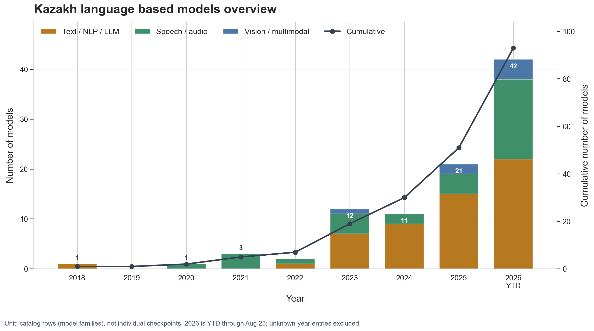
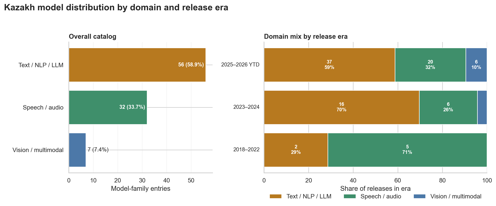
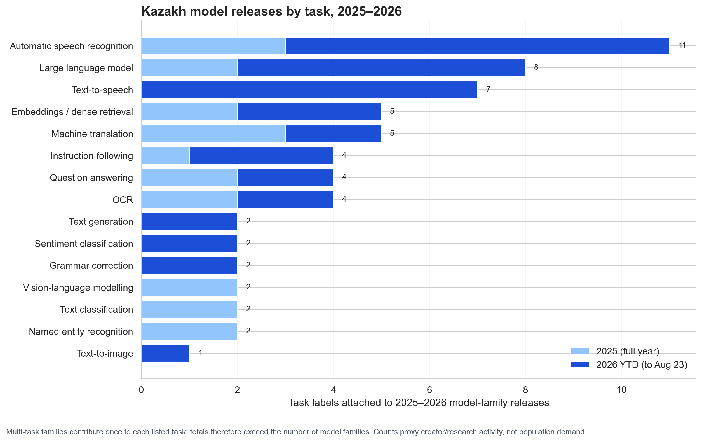
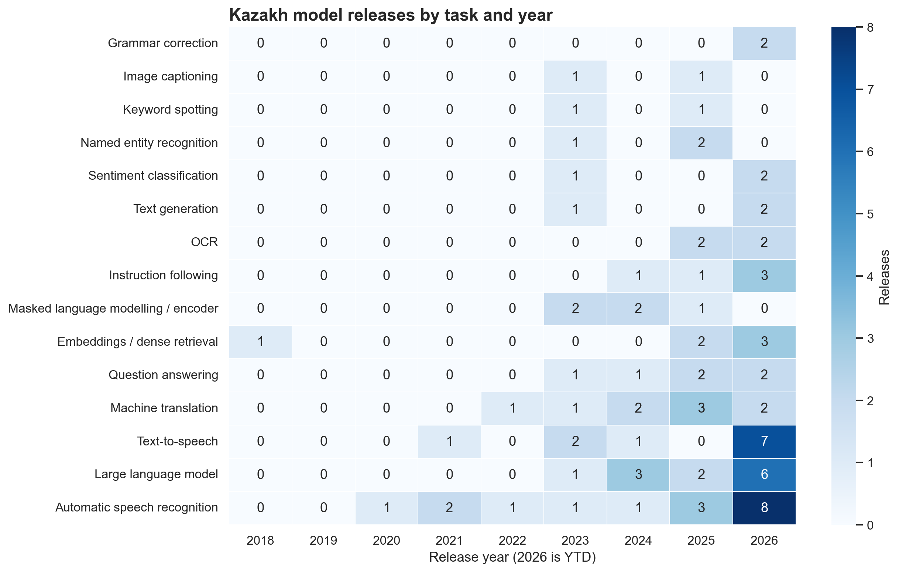
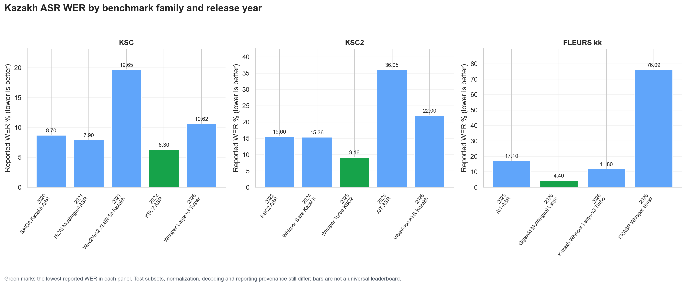
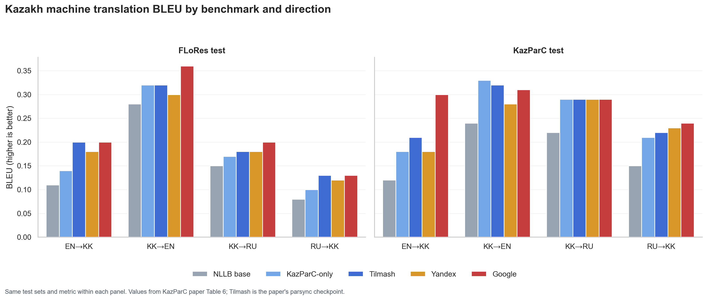
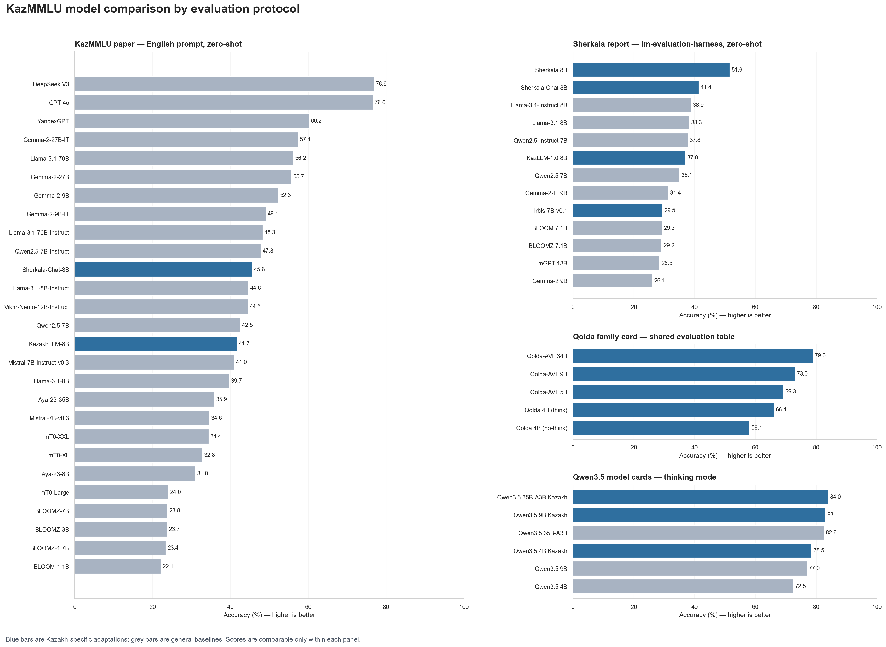
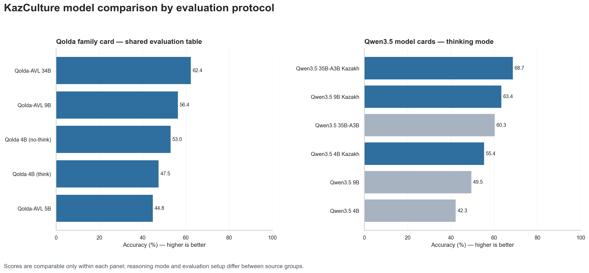
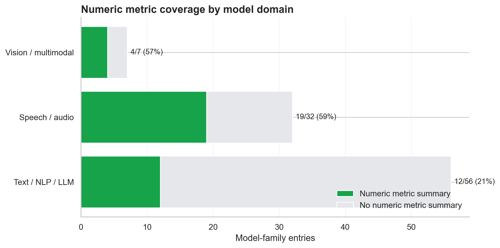

# Deep analytics: Awesome Kazakh Models

Snapshot: **2026-08-23** · source: **`data/models.yaml` on branch `allessyer`** · analysis unit: **one catalog row / model family**

## Executive findings

The catalog contains **95 verified model-family entries**: 93 have a known release year and two do not. Publication activity has accelerated sharply. The annual count rose from 1 in 2018 to 12 in 2023, 21 in 2025, and **42 in 2026 year-to-date through 23 August**. The 2026 YTD count is already 2.00 times the entire 2025 count and 3.50 times the January–August 2025 count (12). This is growth in publicly released catalog entries, not necessarily growth in research papers, users, or commercial adoption.

| Release year | Text/NLP/LLM | Speech/audio | Vision/multimodal | Total | Cumulative known-year entries |
|---:|---:|---:|---:|---:|---:|
| 2018 | 1 | 0 | 0 | 1 | 1 |
| 2019 | 0 | 0 | 0 | 0 | 1 |
| 2020 | 0 | 1 | 0 | 1 | 2 |
| 2021 | 0 | 3 | 0 | 3 | 5 |
| 2022 | 1 | 1 | 0 | 2 | 7 |
| 2023 | 7 | 4 | 1 | 12 | 19 |
| 2024 | 9 | 2 | 0 | 11 | 30 |
| 2025 | 15 | 4 | 2 | 21 | 51 |
| 2026 YTD | 22 | 16 | 4 | 42 | 93 |



The dominant domain is **text/NLP/LLM: 56 of 95 entries (58.9%)**, followed by speech/audio with 32 (33.7%) and vision/multimodal with 7 (7.4%). Text is therefore the cumulative leader, but the mix is broadening. Vision/multimodal grew from one entry before 2025 to six releases in 2025–2026, reaching 9.5% of releases in that recent period. Speech remains structurally important: it accounts for nearly one-third of recent releases and has much better metric coverage than text.



The best proxy for “what society is interested in now” available in this repository is **what model creators are releasing**, not survey or usage evidence. On that proxy, 2025–2026 activity is led by:

1. Automatic speech recognition (ASR): 11 task-labelled families.
2. LLMs: 8.
3. TTS: 7.
4. Embeddings/retrieval and machine translation: 5 each.
5. Question answering, instruction following, and OCR: 4 each.

The especially revealing 2026 YTD pattern is eight new ASR families, seven TTS families, six LLM families, three instruction-following families, and three embedding families. This suggests current creator attention is moving from basic language resources toward deployable voice interfaces, generative models, RAG/retrieval, and multimodal/OCR applications.





## Which models look stronger or weaker?

There is **no valid global leaderboard** across this repository. Metrics include WER/CER (lower is better), BLEU/chrF and accuracy/F1/recall (higher is better), perplexity/loss, retrieval scores, and subjective MOS. Even identical metric names are not comparable when test sets, text normalization, decoding, or evaluation protocols differ. The plots below group only same-named benchmark families and retain provenance warnings.

### ASR performance through the years

Within the KSC benchmark family, the best reported WER is the 2022 KSC2 system's **6.3% on the KSC subset**, followed by the 2021 multilingual IS2AI system at 7.9% and the 2020 SAIDA model at 8.7%. The 2026 Tulpar report is 10.62%, while the 2021 community Wav2Vec2 model reports 19.65%. These values likely use related KSC test material but may differ in corpus version and normalization, so the ranking is indicative rather than definitive.

Within KSC2-labelled evaluations, **Whisper Turbo KSC2 (2025) reports the lowest WER, 9.16%**. The original 2022 KSC2 system reports 15.6% over its six-source overall test, Whisper Base Kazakh reports 15.36%, VibeVoice reports 22.0%, and AIT-ASR measures 36.05% on a 1,000-utterance sample. The precise subsets are not uniform.

FLEURS-kk is the cleanest named cross-model group in the catalog: **GigaAM Multilingual Large reports the lowest WER at 4.4%**, followed by Kazakh Whisper Large-v3 Turbo at 11.8%, AIT-ASR at 17.1%, and KRASR Whisper Small at 76.09%. The last model is optimized for Kazakh–Russian code-switching and is much weaker on FLEURS despite improving strongly over its own Whisper-Small baseline, illustrating why intended domain matters. These remain reported results rather than a centrally reproduced evaluation.



Primary evidence: [SAIDA/KSC paper](https://arxiv.org/abs/2009.10334), [2021 multilingual ASR paper](https://arxiv.org/abs/2108.01280), [KSC2 paper](https://www.isca-archive.org/interspeech_2022/mussakhojayeva22_interspeech.pdf), [GigaAM paper](https://arxiv.org/abs/2607.10371) and [model card](https://huggingface.co/ai-sage/GigaAM-Multilingual), [Whisper Turbo KSC2 card](https://huggingface.co/abilmansplus/whisper-turbo-ksc2), [AIT-ASR card](https://huggingface.co/nur-dev/ait-asr), and [Tulpar card](https://huggingface.co/olzhasAl/whisper-large-v3-tulpar). Exact values and comparability notes are in [`data/asr_metric_comparisons.csv`](data/asr_metric_comparisons.csv).

### TTS quality: evidence exists, but no valid shared plot

All five TTS families below are already present in the main catalog. Their quality evidence is now recorded in the structured analysis, but a cross-family comparison plot is intentionally omitted: the studies do not share the same metric, speakers, sentences, listeners, synthesizer task, or evaluation protocol. Plotting the reported numbers together would imply a ranking that the evidence cannot support.

| Model | Reported Kazakh quality evidence | Valid comparison scope |
|---|---|---|
| KazakhTTS (2021) | Tacotron 2 MOS: 4.535 (female F1), 4.144 (male M1); Transformer MOS: 4.436 and 3.907 | Tacotron 2 versus Transformer is comparable only within the original matched listening study. |
| TurkicTTS (2023) | MOS 4.18; comprehensibility 97%; intelligibility 80% | Its multilingual survey and listening tasks differ from the other studies. |
| KazEmoTTS (2024) | Synthesized-speech MOS 3.51–3.57; average MCD 6.02–7.67 across three voices | Emotional synthesis, different voices, stimuli, and listener protocol. |
| Chatterbox Multilingual Kazakh (2026) | Median round-trip CER 7.4%, mean CER 10.2%, using Whisper-large-v3 on 60 synthesized FLEURS-kk samples | ASR-based intelligibility proxy; not human naturalness and not interchangeable with WER. |
| CosyVoice3 Kazakh (2026) | Mean round-trip WER 37.6% at the selected checkpoint, versus 43.6% at the final step | Supports checkpoint selection within this training run only. |

Primary evidence: [KazakhTTS paper, Table 3](https://arxiv.org/abs/2104.08459), [TurkicTTS paper, Table 3](https://arxiv.org/abs/2305.15749), [KazEmoTTS paper, Tables 3–5](https://arxiv.org/abs/2404.01033), [Chatterbox model card](https://huggingface.co/Tohirju/chatterbox-mtl-kazakh), and [CosyVoice3 model card](https://huggingface.co/Tohirju/cosyvoice3-kazakh-499k). The transcribed values, evaluation scopes, and explicit cross-family-comparability flags are in [`data/tts_quality_evidence.csv`](data/tts_quality_evidence.csv).

### Machine translation: Tilmash

The KazParC paper offers a strong same-test-set comparison of NLLB base, KazParC-only fine-tuning, Tilmash (the paper's `parsync` checkpoint), Yandex, and Google. Averaged over the four directions involving Kazakh shown below:

- On FLoRes, Google is first at mean BLEU 0.2225 and **Tilmash is second at 0.2075**.
- On KazParC, Google is first at 0.2850 and **Tilmash is second at 0.2600**.
- Tilmash ties Google on FLoRes EN→KK (0.20) and RU→KK (0.13), but Google is clearly ahead on KazParC EN→KK (0.30 versus 0.21).
- KazParC-only is slightly better than Tilmash on KazParC KK→EN (0.33 versus 0.32), showing that synthetic-data augmentation is not uniformly beneficial in-domain.



Source: [KazParC paper, Table 6](https://arxiv.org/pdf/2403.19399). Transcribed values are in [`data/tilmash_mt_metrics.csv`](data/tilmash_mt_metrics.csv).

### KazMMLU and KazCulture model comparisons

| Catalog family | KazMMLU evidence | KazCulture evidence | Comparison scope |
|---|---:|---:|---|
| ISSAI Qwen3.5 Kazakh | 4B 78.5; 9B 83.1; 35B-A3B 84.0 | 4B 55.4; 9B 63.4; 35B-A3B 68.7 | Thinking-mode model-card results; each adapted model has a matched base. |
| Qolda 4B | 58.11 no-think; 66.14 think | 53.00 no-think; 47.45 think | Shared Qolda family-card table. |
| Qolda-AVL | 69.27 / 73.04 / 78.98 for 5B / 9B / 34B | 44.75 / 56.39 / 62.37 | Shared Qolda family-card table. |
| Sherkala family | 51.6 base; 41.4 chat | — | Sherkala report's zero-shot `lm-evaluation-harness` table. |
| KazLLM 1.0 8B | 37.0 | — | Sherkala report only. |
| Irbis-7B-v0.1 | 29.5 | — | Sherkala report only. |
| Estimin3n | Evaluation scripts exist; score not public | — | Listed but excluded from numerical plots. |

The KazMMLU figure shows all 51 reported model results in the four audited primary-source comparison groups: 27 from the benchmark paper's English-prompt zero-shot table, 13 from the Sherkala report, five from the Qolda family card, and six from the Qwen3.5 cards. Repeated model families remain in separate panels when their evaluation protocols differ.



The KazCulture figure shows all 11 reported results from the two public shared-table groups. Within Qwen3.5, Kazakh adaptation improves every matched size: 42.3→55.4 at 4B, 49.5→63.4 at 9B, and 60.3→68.7 at 35B-A3B. Qolda's thinking result is lower than its no-thinking result on KazCulture, illustrating why reasoning mode must remain visible rather than being silently mixed.



Primary evidence: [KazMMLU benchmark paper, Table 4](https://aclanthology.org/2025.acl-long.701/), [Sherkala technical report](https://arxiv.org/abs/2503.01493), [Qolda model card](https://huggingface.co/issai/Qolda), [Qwen3.5 4B Kazakh](https://huggingface.co/issai/Qwen3.5-4B-Kazakh), [Qwen3.5 9B Kazakh](https://huggingface.co/issai/Qwen3.5-9B-Kazakh), [Qwen3.5 35B-A3B Kazakh](https://huggingface.co/issai/Qwen3.5-35B-A3B-Kazakh), and [Estimin3n model card](https://huggingface.co/govnejri/Estimin3n). The complete protocol-labelled transcription is in [`data/kazakh_benchmark_comparisons.csv`](data/kazakh_benchmark_comparisons.csv).

### Other paper/model-card metrics not placed on a shared leaderboard

- TurkicOCR-SVTRv2-B reports Kazakh CER 1.71%, while Kazakh TrOCR reports 3.7%. Their test sets differ, so 1.71 cannot be interpreted as a head-to-head win.
- e5-base-kazakh reports Kazakh SNLI R@1 0.887 versus 0.433 for its base and STS-B Pearson 0.817 versus 0.708. KazEmbed-V5 reports Hits@1 72%, Hits@5 96%, and MRR 0.835 on a different retrieval evaluation; the two embedding models cannot be ranked from those figures.
- SozKZ OmniAudio reports 21.28% WER on only 50 in-domain `kzcalm-tts-kk-v1` samples. This is useful internal evidence but not comparable to the public ASR panels. [Model card](https://huggingface.co/stukenov/sozkz-core-omniaudio-70m-kk-asr-v1).

## Evidence quality and limitations

Only **35 of 95 families (36.8%)** have a numeric metric summary in the structured catalog. Coverage is 19/32 (59%) for speech, 12/56 (21%) for text, and 4/7 (57%) for vision/multimodal. Recording the previously omitted benchmark results improves evidence coverage, but not cross-protocol comparability: missing standardized evaluation remains the main obstacle to a trustworthy ranking.



Important interpretation constraints:

- A catalog row can bundle several model sizes or variants. Counts are families, not raw checkpoints.
- Multi-task families count once under every task they list, so task totals exceed 95.
- Release date means public artifact release, not necessarily paper publication.
- Two entries have unknown release years and are excluded from time plots but included in overall totals.
- 2026 is incomplete through 23 August and should not be treated as a full calendar year.
- The repository is curated, so counts measure known qualifying releases and may undercount unlisted, private, deleted, or inaccessible models.
- “Interest” is inferred from release activity. It does not measure users, downloads, funding, or general public preferences.
- Model-card metrics are often self-reported. Some cards provide independently measured results; the CSV records the source type and caveats.

## Reproducing the analysis

From the repository root:

```bash
python3 -m venv .venv
.venv/bin/pip install -r analysis/requirements.txt
.venv/bin/python analysis/analyze_models.py
```

The script regenerates all CSV/JSON tables under [`analysis/data`](data/) and all PNG/SVG plots under [`analysis/figures`](figures/). The flattened catalog used for audit is [`data/catalog_snapshot.csv`](data/catalog_snapshot.csv), the protocol-aware KazMMLU/KazCulture evidence is [`data/kazakh_benchmark_comparisons.csv`](data/kazakh_benchmark_comparisons.csv), the TTS evidence is [`data/tts_quality_evidence.csv`](data/tts_quality_evidence.csv), and the compact machine-readable summary is [`data/summary.json`](data/summary.json).
